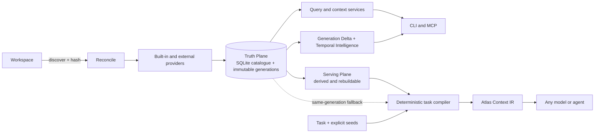

<div align="center">

# Workspace Atlas

**Verified project context for coding agents**

**Turn a changing repository into a small, current, evidence-backed working set—without making every agent relearn the codebase from scratch.**

`v2.0.0 release candidate` · `Source-first` · `Local-first` · `Provider-neutral` · `CLI + MCP` · `MIT OR Apache-2.0`

</div>

---

## Why Atlas

Coding agents repeatedly pay a **repository rediscovery tax**. Before making a useful change, an agent often has to list directories, search broad terms, open large files, follow imports, locate tests, and decide which evidence is current. The same work is repeated by the next agent—or by the same agent in its next session.

That cost is not only time and tokens. Partial scans, stale source, guessed relationships, and hidden uncertainty are common paths to confident but incorrect changes.

Workspace Atlas makes project understanding persistent. It maintains a local, incrementally reconciled catalogue of files, revisions, symbols, relationships, effects, providers, coverage, conflicts, and lifecycle history. Queries and task compilation then select bounded evidence from one immutable generation instead of rediscovering the repository from scratch.

## The core idea

> **Compile project truth eagerly. Compile task context lazily.**

```text
SOURCE + HISTORY + PROJECT STATE + TASK
                 │
                 ▼
          WORKSPACE ATLAS
                 │
                 ▼
  BOUNDED, VERIFIED WORKING SET
                 │
                 ▼
          ANY MODEL OR AGENT
```

Atlas is not a source-of-truth replacement, an opaque memory dump, or a learned ranking system. Source, builds, tests, and runtime evidence remain authoritative. Atlas records where evidence came from, what generation it belongs to, and whether it is verified, unresolved, conflicting, stale, omitted, or unavailable.

## What Atlas does today

| Capability | What it means |
|---|---|
| **Persistent project truth** | File identities and revisions, symbols, relationships, effects, diagnostics, coverage, conflicts, and lifecycle events survive beyond one task. |
| **Incremental reconciliation** | Content-addressed revisions let unchanged files and reusable provider evidence avoid unnecessary reprocessing. |
| **Provider-neutral evidence** | Built-in structural providers and optional external SCIP providers map into one qualified evidence model. |
| **Immutable generations** | A candidate generation activates atomically; readers never observe a partially updated catalogue. |
| **Bounded query surfaces** | Find, inspect, trace, impact, source, history, and Map/Change/Audit context operations expose controlled slices of project evidence. |
| **Deterministic task compilation** | Explicit V1.3 compilation selects task-kind-specific callers, callees, tests, configuration, and graph depth into generation-bound Context IR—without embeddings or learned ranking. |
| **Context route discovery** | The Context Governor contract distinguishes `DIRECT`, target-bounded `ATLAS_LIGHT`, and `ATLAS_DEEP`; capability discovery reports which route features are currently available. |
| **Temporal intelligence** | V1.4 explains bounded change between retained committed generations and live-verifies returned current evidence. |
| **Exact-source safety** | `atlas source` checks the live file hash before returning source for change-mode use and blocks stale content. |
| **Legacy lifecycle truth** | Local CLI commands start, inspect, complete, or abandon legacy task sessions with closed transitions and exact replay rules. |
| **File lifecycle truth** | Renames require unambiguous exact-content-hash evidence; deleted files retain metadata, not raw source snapshots. |
| **Privacy retention** | Local CLI compaction removes eligible session-derived data transactionally while preserving indexed Truth and generation history. |
| **CLI and MCP parity** | Shared read operations call the same application functions; destructive and filesystem authority remains CLI-local and is excluded from MCP. |
| **Local-first authority** | Atlas requires no cloud service, never mutates workspace source, and confines catalogue mutation to explicit local operations. |
| **Caller-driven freshness** | No daemon or watcher is required; callers reconcile explicitly when freshness is unknown. |

### From a task to evidence

A request such as:

```text
Fix reconnect behavior without changing login semantics.
```

can use an explicit legacy compiler:

```sh
./target/release/atlas context-ir <path-to-a-repository> \
  "fix reconnect behavior without changing login semantics" \
  --task-kind bug_fix \
  --symbol ConnectionController.scheduleReconnect \
  --max-records 40 \
  --max-source-bytes 32768 \
  --max-estimated-tokens 8000
```

The resulting legacy Context IR identifies the selected task kind and rule,
primary evidence, caller and callee relationships, relevant tests, uncertainty,
omissions, generation, selection reasons, and costs. Source references are
indexed ranges—not authorization to edit. Use `atlas source` to live-verify
source before change-mode use.

`context-ir` requires at least one explicit `--symbol` or `--path` for a useful
working set. If `--task-kind` is omitted, Atlas applies an ordered whole-word
rule table and reports the selected kind, source, and stable rule ID;
unrecognized task text remains `unknown`. Record, source-byte, and token
budgets must be positive and fail closed otherwise.

For callers that negotiate the Context Governor, use this table as the single
compatibility, route, capability, and authority reference:

| Surface or route | When and result | Generation and contract | CLI | MCP and authority |
|---|---|---|---|---|
| Capability discovery | Inspect supported routes, closed vocabularies, versions, availability, and advertised bounds before building a request. | `context-capabilities-v2.0.0`; discovery is not a runtime profile or default. | `atlas governor capabilities` | `atlas_governor_capabilities`; read-only. |
| `DIRECT` | Intent `none` forces this route; intent `allow` can start here only with a `DIRECT` floor. When all requested capabilities are caller-satisfied, success returns `direct_none`: zero Atlas calls and no Atlas context identity, packet, or IR. | Records the starting generation as observed or typed unavailable, but does not pin or compile it. | `atlas governor run` | `atlas_governor_run`; materialization-disabled; a validated legacy binding may activate on successful acquisition. |
| `ATLAS_LIGHT` | Explicit-target identity lookup, exact source reference, bounded relationships, impact frontier, or basic coverage/conflicts. Returns ordered `query-v1.0.0` and/or `source-reference-v1.0.0` results; never a Context Packet or Context IR. | One captured generation; changed or unavailable generation stops and requires resubmission. | `atlas governor run` | `atlas_governor_run`; target-bounded; a validated legacy binding may activate on successful acquisition. |
| `ATLAS_DEEP` | Temporal history, required-role closure, and validation planning for deep synthesis. Successful execution returns the transient execution envelope plus Context IR. | `context-execution-v2.0.0`, Context IR `2.0.0`, and `planner-v2.0.0`; all six positive DEEP limits are required whenever the ceiling permits DEEP. Discovery reports `deep_context_ir` available. | `atlas governor run`; bounded explicit source materialization is CLI-only and response-lifetime. | `atlas_governor_run`; materialization-disabled; a validated legacy binding may activate on successful acquisition. |
| Explicit V1 operations | Existing `find`, `inspect`, `trace`, `impact`, `source`, `context`, `context-ir`, and related explicit commands retain their existing syntax and semantics. They are neither silently routed nor deprecated. | Legacy Context Packet/Context IR contracts remain explicit; `context-ir` uses Context IR `1.0.0` and `planner-v1.1.0`. | Existing commands remain available. | The existing 13 tools remain available and unchanged. |
| Legacy lifecycle reads | Read legacy task sessions, compiled contexts, Context Yield, and Serving readiness through bounded pages. V2 durable lookup fails as `durable_contract_unavailable`. | Legacy lifecycle `1.0.0`; default page limit 50, maximum 200, cursor maximum 4 KiB. | `task show`, `compiled-context show`, `context-yield show`, `serving-status` | Exactly four corresponding show/status tools; read-only. |
| Local lifecycle mutation | Start, complete, or abandon legacy sessions; reconcile; build Serving projections; inspect/apply privacy retention; preview unregister or invoke its fail-closed confirmed boundary. | No durable V2 state is introduced. Literal confirmations and complete manifests bind destructive requests. | Local CLI only. | Excluded: explicit task start/complete/abandon commands, retention/compaction/unregister, serving build/rebuild, backup/export, caller-path writes, filesystem mutation, and destructive authority. |

Availability is authoritative, not implied by the route vocabulary. Current
discovery reports `route_decision`, `light_payload`, `progressive_execution`,
`deep_context_ir`, and `materialization` available. Materialization availability
describes the bounded, explicit, CLI-only response-lifetime capability.
MCP materialization remains disabled. Availability describes runtime features,
not durable V2 lifecycle storage: bounded legacy reads reject V2 lookup as
`durable_contract_unavailable`.

Intent and floor take precedence over caller sufficiency: `allow` starts at the
explicit floor, while `require` raises the effective floor and initial route to
at least `ATLAS_LIGHT`. A non-DIRECT floor therefore acquires Atlas context even
when every requested capability is caller-satisfied.

Route names describe **context-acquisition depth**, not model tier. Atlas does
not select cloud or local models, route by vendor, or choose a model at all.
Callers may finish at any permitted route; full Context IR is not mandatory.

A task-oriented governor contract flow, when discovery permits each step, is:
discover capabilities; run from `DIRECT` through the allowed and available
ceiling; use returned target-bounded references;
live-verify exact source; validate the outcome; reconcile when project state
changed; then complete the legacy session from `reconciled`. Abandon is a
separate terminal branch from `active` or `reconciled`. See the exact request,
command, output, lifecycle, and retention contracts in
[`OPERATIONS.md`](OPERATIONS.md) and the decision rationale in
[ADR-023](docs/adr/023-context-compiler-contract.md).

When a validated legacy session is explicitly bound to the task, successful
context acquisition is its activation boundary. Completed `DIRECT`
`direct_none` activates without fabricating Context IR; completed or useful
partial LIGHT/DEEP acquisition can activate; blocked, interrupted, error, and
no-useful-payload outcomes cannot. A successfully committed newer generation
atomically reconciles every and only older-generation active legacy session in
that workspace, in the same `BEGIN IMMEDIATE` transaction as candidate commit
and the active-generation pointer. Completion and abandonment remain explicit
public terminal transitions.

The goal is not the smallest packet at any cost. It is the minimum sufficient
trustworthy packet: enough verified evidence to complete the task without
burying the model in irrelevant source or hiding important uncertainty.

## Architecture



### Truth Plane

The canonical catalogue holds workspace, file, and revision identities; provider executions and diagnostics; symbols and exact source ranges; structural and semantic relationships; effects, coverage, conflicts, resolution state, lifecycle history, and immutable generations. A failed candidate never partially replaces the last valid active generation.

### Serving Plane

The Serving Plane is a deterministic, generation-bound projection of truth for efficient selection. It contains derived symbol, relationship, and coverage views and can be deleted and rebuilt. Context IR compilation prefers a ready projection but falls back to the same generation's Truth Plane and reports `serving_fallback: true`.

### Context and temporal planes

Map, Change, and Audit packets provide bounded general context. The V1.3 compiler adds fixed, versioned recipes for declared or deterministically classified task kinds; equivalent seed sets are sorted and deduplicated before identity and hash calculation. Every selected item keeps its role, reason, distance, evidence state, generation, and cost, while unresolved relationships remain uncertainty or omissions.

V1.4 Temporal Intelligence compares the active committed generation with its retained parent or an explicitly selected retained committed ancestor. It reuses Generation Delta categories and reason codes, live-verifies returned current-file changes and unchanged symbol contracts, and reports bounded omissions as risk rather than generalizing beyond the returned evidence.

## Quick start

### Requirements

- Rust `1.94` or newer, with Cargo.
- Python 3 on `PATH` only when running `atlas-bench`.
- An optional SCIP provider executable only when semantic provider evidence is configured; Atlas does not install providers.

### Build from source

The current installation path for the v2.0.0 release candidate is a locked source build:

```sh
git clone https://github.com/Zerolitter/Workspace-Atlas.git
cd Workspace-Atlas
cargo build --release --locked
```

This builds `atlas`, `atlas-mcp`, and `atlas-bench` under `target/release/`.
No prebuilt binary distribution is currently provided.

### Index and query a workspace

```sh
./target/release/atlas init <path-to-a-repository>
./target/release/atlas reconcile <path-to-a-repository>
./target/release/atlas status <path-to-a-repository>

./target/release/atlas find <path-to-a-repository> someSymbolName
./target/release/atlas inspect <path-to-a-repository> src/some-file.ts
./target/release/atlas context <path-to-a-repository> \
  "investigate someSymbolName" --mode map
./target/release/atlas temporal <path-to-a-repository> --max-records 50
```

Commands emit JSON by default. `--human` pretty-prints valid JSON. Use `atlas <command> --help` for complete flags and [`OPERATIONS.md`](OPERATIONS.md) for catalogue behavior, recovery, migrations, provider setup, MCP, and limitations.

## Command reference

| Command family | Purpose |
|---|---|
| `atlas init|reconcile|status|doctor <root>` | Register, refresh, inspect, and recover a workspace catalogue. |
| `atlas providers <root>` | Report configured provider capabilities and state. |
| `atlas find|inspect|trace|impact|source <root> ...` | Query bounded indexed evidence or live-verified exact source. |
| `atlas context|context-ir <root> ...` | Invoke explicit legacy Context Packet or Context IR behavior. |
| `atlas serving-build|generation-delta|temporal|history <root> ...` | Build a disposable projection or inspect retained generation/lifecycle evidence. |
| `atlas governor capabilities|run <root> ...` | Discover the Context Governor contract and invoke currently available route behavior. |
| `atlas task start|show|complete|abandon <root> ...` | Operate the explicit legacy task lifecycle. |
| `atlas compiled-context show|context-yield show|serving-status <root> ...` | Read bounded legacy context, yield, and Serving readiness. |
| `atlas retention status|compact <root> ...` | Inspect fixed privacy retention or transactionally compact eligible derived/session data. |
| `atlas unregister <root> ...` | Preview complete catalogue loss or invoke the currently fail-closed confirmed unregister boundary. |

Every additive workspace command accepts optional explicit
`--catalogue <path>`. The exact grammar and JSON request documents are in the
[operator guide](OPERATIONS.md#context-governor-and-lifecycle-commands); use
`atlas <command> --help` as the executable reference.

`context-yield show` and `atlas_context_yield_show` retain their legacy
paginated fields and add a `report` projection only for an accepted completed
session with validated retained legacy Context IR. The projection uses the
existing `ContextYieldReportV15` contract, including deterministic report and
accepted-outcome identity, typed metric evidence and invalidity, validity, and
limitations. Incomplete, abandoned, rejected, or context-free sessions return
`report: null`.

## Catalogue and operating model

Without `--catalogue <path>`, Atlas places one SQLite catalogue per workspace in the platform application-data directory:

| Platform | Catalogue location |
|---|---|
| Windows | `%LOCALAPPDATA%\WorkspaceAtlas\catalogues\<workspace_id>.sqlite` |
| macOS | `$HOME/Library/Application Support/WorkspaceAtlas/catalogues/<workspace_id>.sqlite` |
| Linux | `$XDG_DATA_HOME/workspace-atlas/catalogues/<workspace_id>.sqlite`, or `$HOME/.local/share/workspace-atlas/catalogues/<workspace_id>.sqlite` |

`atlas init` writes an atomic root-to-catalogue locator. Later root-addressed commands verify the locator, catalogue identity, path confinement, and workspace row; missing, corrupt, escaping, mismatched, or ambiguous routes fail closed. Missing, empty, or relative platform environment paths are errors, and Atlas never falls back to the current working directory for catalogue placement.

Reconciliation is caller-driven and uses a 60-second single-writer lease. Concurrent writers fail fast, while readers remain on the last complete active generation. The catalogue is one SQLite file: copy it only while reconciliation is idle, and run `atlas doctor` after restoration. Migrations are forward-only, ordered, idempotent, and checksum-verified; rollback requires restoring a pre-upgrade backup.

## Semantic providers and MCP

External providers are optional and explicitly configured. Atlas invokes
configured executables directly without a shell, applies an environment
allowlist, bounds provider output, and records provider identity and execution
evidence. Required-provider failure blocks candidate activation;
optional-provider failure remains visible as degraded coverage. See the
[configuration example](config/workspace-atlas-v1.1.config.example.toml) and
pinned [SCIP provenance](schemas/scip/PROVENANCE.md).

`atlas-mcp` is a newline-delimited JSON-RPC 2.0 stdio adapter. Clients send
`initialize` first. Discovery returns the frozen existing 13 tools followed by
the six compiler and lifecycle-discovery tools:

```text
atlas_status                   atlas_find
atlas_inspect                  atlas_trace
atlas_impact                   atlas_source
atlas_context                  atlas_history
atlas_providers                atlas_context_ir
atlas_serving_build            atlas_generation_delta
atlas_temporal                 atlas_governor_capabilities
atlas_governor_run             atlas_task_show
atlas_compiled_context_show    atlas_context_yield_show
atlas_serving_status
```

The current additive MCP capability protocol remains `1.3`; Atlas capability,
route, execution, IR, and operation versions are negotiated separately.
`workspace_root` is required and `catalogue` is optional. The authority of the
six additions is shown in the [canonical table](#from-a-task-to-evidence).
MCP governor execution shares the validated acquisition-bound activation
semantics described above, but MCP adds no explicit task
start/complete/abandon command, retention, compaction, unregister,
filesystem-write, export, backup, or destructive authority. The shared
interface contract is recorded in
[ADR-017](docs/adr/017-shared-cli-mcp-application-layer.md).

## Guarantees and boundaries

1. **Source stays authoritative.** The catalogue accelerates understanding; it does not replace current source, builds, tests, or runtime evidence.
2. **Evidence stays qualified.** Provider, method, confidence, generation, coverage, resolution, and conflict state remain visible.
3. **Prediction is not evidence.** Deterministic ranking and future optimization policies cannot silently become project truth.
4. **History is not current state.** Deleted and renamed evidence is available through lifecycle queries without polluting ordinary current queries.
5. **Failure preserves valid truth.** Failed reconciliation cannot partially activate a candidate generation.
6. **Derived data is disposable.** Serving projections and compiled context remain reconstructable from canonical evidence.
7. **Uncertainty stays explicit.** Conflicts, unresolved edges, partial coverage, staleness, omissions, and unavailable source belong in the result.
8. **Source mutation is outside Atlas authority.** Indexing a project never grants permission to change it.

Discovery classifies secret-bearing, vendor, build, and generated paths before indexing; paths remain confined to the canonical workspace and symlinks are rejected by default. Atlas stores metadata for deleted files rather than raw snapshots and is not intended to persist raw credentials.

### Current limitations

- Dynamic or reflective edges remain unresolved without provider evidence.
- Rename detection requires an unambiguous exact-content-hash match.
- Deleted-file tombstones retain metadata only; raw snapshots are not stored.
- Privacy compaction has a fixed policy; no configurable retention profile or
  generation-history compaction policy is introduced.
- Confirmed unregister currently returns `unregister_unavailable` before any
  deletion because cross-root writer exclusion, quarantine, and rollback are
  not yet proven. Dry-run remains available and truthful.
- Temporal live verification covers only returned change and
  unchanged-contract records; omitted evidence is reported as risk rather than
  treated as current.
- Excluded directories are classified but may still be traversed, which can
  increase reconciliation time for very large build or dependency trees.

## Release status and roadmap

Workspace Atlas v2.0.0 is the first release candidate. Roadmap
labels describe capability milestones independently of crate semantic versions.

| Milestone | Status | Outcome |
|---|---|---|
| **V1.1 — Semantic Truth** | Shipped prerequisite | Know the project accurately with qualified structural and optional SCIP semantic evidence. |
| **V1.2 — Context IR + Observability** | Shipped prerequisite | Represent and measure generation-bound context with task sessions, Serving Plane projections, Generation Delta, and typed Context IR. |
| **V1.3 — Deterministic Task Compiler** | Complete | Give different task kinds the fixed evidence recipes they require. |
| **V1.4 — Temporal Intelligence** | Complete | Explain what changed and what unchanged evidence remains live-verified. |
| **V1.5 — Working-Set Qualification** | Post-v2 qualification | Retained benchmark work may inform later deterministic policy changes; it is not a runtime learning system or public performance claim. |
| **V2.0 — Project Context Compiler** | **Release candidate — 2026-09-10** | Provide progressive DIRECT/LIGHT/DEEP acquisition and bounded, transient Context IR `2.0.0` while preserving explicit V1 compatibility. |

This release candidate makes no performance, capacity, or service-level guarantee.
Final release is an atomic step that will update this wording without otherwise changing the documented contract.

### Compatibility

- Existing explicit V1 CLI commands and all 13 original MCP tools keep their
  names, arguments, envelopes, errors, and behavior. They are not silently
  routed and are not deprecated.
- Governor capability (`context-capabilities-v2.0.0`), route/decision
  (`context-route-v2.0.0`), execution (`context-execution-v2.0.0`), Context IR
  (`2.0.0`), planner (`planner-v2.0.0`), LIGHT operation, MCP protocol, Cargo,
  catalogue, config, provider, and any future profile versions are independent
  contracts. A shared numeral does not make them interchangeable.
- Context IR `1.0.0` readers reject `2.0.0`. V2-aware code may explicitly read
  a legacy document, but cannot reinterpret it as V2 sufficiency.
- Governor execution is transient. This public contract adds no durable V2
  catalogue state, migration, runtime route profile, or route default.
- The possible future Agent Skill remains absent; its separately gated
  packaging, procedural-only, and no-project-truth boundary is recorded in
  [ADR-023](docs/adr/023-context-compiler-contract.md).
- Temporal reports never invent missing history. A first committed generation
  returns `baseline_only` with unknown risk until a retained committed ancestor
  exists.

See the public [changelog](docs/CHANGELOG.md) for release details and
compatibility notes. Bug reports and focused changes are welcome through
[CONTRIBUTING.md](CONTRIBUTING.md); report vulnerabilities privately as
described in [SECURITY.md](SECURITY.md).

## Verification and contributing

Package consumers can run the locked product checks:

```sh
cargo test --locked
cargo test --locked --test task_compiler_v13
cargo test --locked --test temporal_intelligence_v14
cargo run --release --locked --bin atlas-bench
```

In a repository source checkout, maintainers should additionally run:

```sh
cargo fmt --all -- --check
python scripts/check-public-hygiene.py
```

`atlas-bench` creates a deterministic public pilot fixture in the system temporary directory and verifies catalogue, query, lifecycle, and incremental-reconciliation behavior against its manifest.

The repository is organized around auditable boundaries:

```text
src/            Library and shared application services
bin/            atlas, atlas-mcp, and atlas-bench entry points
migrations/     Forward-only, checksum-verified SQLite migrations
schemas/scip/   Pinned SCIP schema and provenance
config/         Public provider configuration example
tests/          Integration, contract, fixture, and runtime-boundary tests
docs/           Changelog and public architecture decisions
```

Start with the [operations guide](OPERATIONS.md), [documentation index](docs/README.md), and [architecture decision records](docs/adr/README.md). Keep CLI and MCP behavior in the shared application layer, preserve closed serialized contracts, and pair public behavior changes with executable evidence and compatibility notes.

## License

Licensed under either the [Apache License 2.0](LICENSE-APACHE) or the [MIT license](LICENSE-MIT), at your option. See the public [license decision](docs/adr/022-dual-license.md).

---

<div align="center">

**Stop making models relearn the repository. Give them the verified project context they actually need.**

</div>
