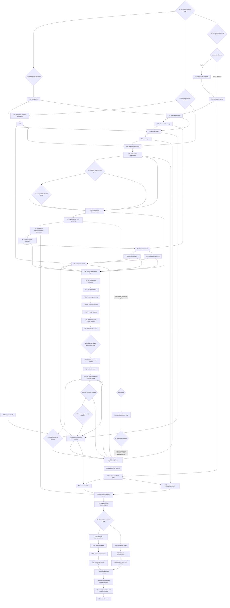

# Implementation Plan: V1.5 Working-Set Optimization → V2.0 Project Context Compiler

## Planning checkpoint

- Documentation checkpoint base/branch: `059ef8894d90e84b6a21e559744f1f8ca1476379` on `Zerolitter/roadmap-v15-v20`. Earlier implementation and benchmark evidence retains its original revision labels below.
- Durable authority: [`capability-map.md`](capability-map.md), the accepted/gated decision record in [`decision-checkpoint.md`](decision-checkpoint.md), and the linked module specs in this directory.
- Disposable execution state belongs in Orca orchestration only; this repository contains no generic execution-tracking directory/checklist.
- This checkpoint changes no production source, schema, version, behavior, release, tag, artifact, visibility, `main`, or `selfhost/rust-scip-provider`.
- Repository privacy is intentional. Unauthenticated GitHub 404 is expected; public-adoption findings remain H8 prerequisites, not a request to make the repository public.

Completed and not to be redispatched: T01–T25 and their accepted repairs through exact candidate `cb8457666ea0dbccdaf5819972d112ab20c6aeb6`, including T26–T28. Their task contracts remain below as retained implementation evidence/history.

H8-E0 was accepted on 2026-09-05 as bounded pre-authorization for bundle A–C. The 2026-09-10 product-outcome reset now supersedes T34–T36 and the former hosted/capacity prerequisites for pre-v2.0 completion: private-PR/hosted execution, the full campaign, and statistical/H8 capacity review are retained post-v2.0 qualification work unless a direct release-critical requirement cannot be proved smaller. Final acceptance and bundle-D authority remain withheld.

Pre-v2.0 work is limited to Truth Plane correctness/non-weakening, architecture/security, fail-closed stale/error behavior, persistence and fresh-session recovery, normal OMP-to-Atlas end-to-end use, one bounded representative local performance/capacity smoke, and focused regressions for changed behavior. This list is exhaustive: do not use GitHub or hosted execution. Every retained test must identify the exact protected requirement. Do not refactor the benchmark, add dashboards or speculative abstractions, resume a capacity shard, or reopen accepted work without contradictory runtime evidence.

## Outcomes and non-goals

### V1.5 outcome

Produce accepted-outcome-gated, privacy-bounded measurements of supplied, observed, reported, expanded, rediscovered, changed, and validated evidence; actual compiler/serving/route stage cost; comparable profile/route experiments; and explicit deterministic policy proposals. H4 retains `planner-v1.1.0` and explicit defaults, promotes no H3-A profile, and adds no adaptive runtime selection.

### V2.0 outcome

Add a deterministic Context Governor in the Context Plane, then complete deep-only Context IR `2.0.0`. `repository truth + task + explicit seeds + bounded fixed policy` may yield DIRECT zero-context success, bounded ATLAS_LIGHT results, or an ATLAS_DEEP deterministic generation-bound IR. Exact source remains separately live-authorized; adapters may render but not reinterpret IR.

### Non-goals

- learned/probabilistic/outcome-fed routing, embeddings, internal model calls, co-access prediction, model/vendor-specific tuning, or file-size-only routing;
- source mutation or autonomous editing;
- cloud sync/telemetry upload or raw prompt/source retention by default;
- mandatory daemon/provider on compiler hot path;
- Cargo version bump, public release, tag, production artifact, publication, visibility change;
- changing existing behavior during this planning checkpoint.

## Architecture decisions

1. **Measure before optimize.** V1.5 instrumentation/observation/metrics precede profile or planner changes.
2. **H4 retains current runtime policy.** Keep `planner-v1.1.0` and explicit defaults; promote no H3-A profile. Changed ordering, roles, sufficiency, estimator-dependent selection, or route semantics requires a new fixed identity.
3. **Progressive context is optional.** The repaired fixed `context-route-v2.0.0` governor evaluates DIRECT → ATLAS_LIGHT → ATLAS_DEEP. Every decision observes starting generation or typed unavailability, but DIRECT may succeed with zero Atlas context. The unreleased V1 route seam is superseded, not retained in parallel.
4. **Deep-only semantic contract.** Context IR `2.0.0` is emitted only by ATLAS_DEEP. H5's schema choice is caused by semantic-contract change, not selective routing.
5. **Canonical IR, transient execution/source.** IR keeps verified digest/range references and deterministic budgets/results/omissions. Source bodies, prompts, route attempts, wall deadlines, retries, cancellation/interruption, cache, measured time, and other transient state use repaired `context-execution-v2.0.0`; its successor identity removes the obsolete Context Packet payload variant while retaining the execution state/counter semantics.
6. **Truth/Serving/Context separation.** Truth stays immutable/task-independent; Serving is a disposable accelerator inside Atlas routes, not a route; Context owns governor/IR.
7. **MCP conformance first.** Negotiate official protocol versions and publish accurate schemas before new V1.5/V2 tools.
8. **Audit prerequisites are real.** Configuration/privacy, lifecycle, CI, capacity, and distribution gates remain required before adoption claims. Expected private 404 is not a defect.
9. **Forward-only migration only when necessary.** Classification-only `H7-C/PRE` approves the exact `0004_file_classification_identity` implementation/review increment in [`SPEC-file-classification-identity.md`](SPEC-file-classification-identity.md); `H7-C/POST` is still required before live catalogue use. Every unrelated durable field remains H7-gated with old-catalogue, backup/restore, fault, and no-downgrade proof.
10. **Future Agent Skill compatibility, not scope.** Keep capability discovery and route/result semantics transport-neutral across CLI/MCP/future SDK. The future skill must adapt to H6B-A0's frozen shared public application/CLI/MCP semantics while remaining procedural, separately packaged/versioned, and absent until reviewed content and authority arrive; this checkpoint neither implements the skill nor freezes skill-specific transport spelling.

## Phases and checkpoints

### Phase A — Trust and measurement foundations

H1, H2-A, H3-A, H4 retain-current, H5 Context IR `2.0.0`, H6A-A, and H6B-A0 are accepted and durably recorded in [`decision-checkpoint.md`](decision-checkpoint.md). H4/H5 authorize only the downstream fixed-policy/contract work described here, and H6B-A0 freezes a contract without exposing capabilities; none approves production implementation in this checkpoint. Remaining privacy continuity, surface availability, migration, adoption, and release work stays gated.

**Checkpoint A:** accepted decisions are recorded; completed implementation is preserved; no new product surface is created by this documentation checkpoint.

### Phase B — V1.5 trustworthy Context Yield

T05–T07 complete observation, outcome linkage, and metric derivation. T08’s Context Yield contract does not amend Context IR. T08–T10 add the versioned yield report, experimental profiles, and controlled experiments without changing runtime compiler policy.

**Checkpoint B / H4 resolved:** raw evidence was reviewed; `planner-v1.1.0` and explicit defaults remain, no H3-A profile is promoted, and no adaptive runtime policy is introduced. Experiments remain evidence for a future separately approved fixed identity.

### Phase C — V2.0 canonical compiler

H5 approved Context IR `2.0.0` and the initial `context-execution-v1.0.0`. T28 established the initial immutable decision, execution-envelope, capability-discovery, generation, vocabulary, negotiation, and compatibility contracts; G2 now cleanly replaces the unreleased route, discovery, and closed execution-payload seams with `context-route-v2.0.0`, `context-capabilities-v2.0.0`, and `context-execution-v2.0.0`. T11 freezes the complete deep IR field matrix under unchanged `planner-v2.0.0`; later tasks populate only those fields. T24 enforces required explicit V2 semantic budgets; T12–T16 complete source, seed, temporal, lease, and Serving behavior. Public defaults remain legacy and deep is never mandatory.

No V2 context/decision/envelope persists before its applicable H7 gate. Classification-only `H7-C/PRE` is the narrow exception permitting migration `0004` implementation and review; it authorizes no live catalogue application and no unrelated V2 durability. `H7-C/POST` follows implementation and fresh review before first live use.

**Checkpoint C:** ContextRouteDecision, Context IR compatibility fixtures, deterministic routes/semantics, starting-generation/generation-change behavior, stale/unavailable source, fault, fallback equivalence, and bounded scaling pass.

### Phase D — Product lifecycle and surfaces

T17 and its repair chain are accepted at checkpoint `059ef8894d90e84b6a21e559744f1f8ca1476379`. H6B-A0 freezes the T20 contract, but T20 stays blocked until this documentation repair is freshly accepted; it may then proceed only in disposable/test catalogues to prove privacy compaction and the external lock/quarantine/fault boundary for truthful whole-catalogue unregister. T18 remains blocked on completed T20 plus `H7-C/POST` and must split shared application/lifecycle ownership from later CLI parsing; T19 follows T18.

**Checkpoint D / H6B-A0:** the corrected grammar, shared `GovernorRunRequest`, six explicit V2 limits, legacy lifecycle, restart-stable bounded cursors, manifest confirmation/exclusion, truthful unregister loss, and exactly six read-oriented additive MCP names are frozen. Those six expose no source materialization or mutation/build/destructive authority. Existing explicit commands and all 13 existing MCP tools remain unchanged, including the derived-Serving `atlas_serving_build` operation; selection exposes nothing.

### Phase E — Private quality/distribution evidence

T22 adds the private CI and fixed-route benchmark matrix, T23 adds executable distribution-readiness gates, and T25 adds security/support/troubleshooting/capacity documentation.
The future Agent Skill architecture is a cross-cutting compatibility constraint across T28/T17/T18/T19/T21/T22, not another task or phase. Atlas remains repository truth; the skill may only teach how to invoke public Atlas semantics.

**Checkpoint E / H8:** independently review configuration/privacy, MCP, lifecycle, platform, package, provider, capacity, supply-chain, security/support, and usability evidence. The gate cannot publish, tag, release, create artifacts, change visibility, or update protected branches without separate authorization.

**Retained H8-E0 history:** the 2026-09-05 bundle A–C sequence originally put T30A–T36 before final H8. The 2026-09-10 product-outcome reset supersedes that pre-v2.0 sequencing: T34–T36 remain post-v2.0 qualification, while pre-v2.0 work follows only the exhaustive local product evidence listed in the planning checkpoint.

## Small vertical implementation tasks

Every task is limited to five exact allowed files, frozen before RED. A path may be added only by updating the plan or creating a separately identified task before editing; never widen ownership in flight. File names marked “new” are proposals, not authorized creation until the relevant H-gate.

### T01 — Fail-closed configuration pattern safety

- **Module:** `configuration-privacy-boundary`
- **Dependencies:** H2.
- **Allowed files (4):** `src/config.rs`, `src/discovery.rs`, `config/workspace-atlas-v1.1.config.example.toml`, `tests/config_privacy.rs` (new).
- **RED:** shipped glob-looking examples either parse incorrectly or silently fail; `.key` default and excluded-tree pruning fixtures expose current gaps.
- **GREEN:** one documented pattern language compiles once/fails closed, `.key` matches the safety claim, shipped config behaves as documented, excluded directory traversal is pruned.
- **Verify:** `cargo test --locked --test config_privacy`; `cargo test --locked discovery::tests`.
- **REFACTOR:** one compiled pattern-policy type shared by parser/discovery; no second matcher convention.
- **Rollback:** revert the four-file slice; no persisted format changed.

### T02 — Durable configuration continuity

- **Module:** `configuration-privacy-boundary`
- **Dependencies:** T01, H2.
- **Allowed files (4):** `src/config.rs`, `src/workspace.rs`, `src/cli.rs`, `tests/config_continuity.rs` (new).
- **RED:** initialize with custom policy then reconcile without it; prove silent default substitution/mismatch.
- **GREEN:** application-owned registered config identity/copy is reused or reconcile fails typed; status/doctor expose effective/registered hashes without raw secrets; old catalogue path covered using existing storage.
- **Verify:** `cargo test --locked --test config_continuity`; `cargo test --locked cli::tests`.
- **REFACTOR:** one application-owned resolution path; no duplicated CLI config fallback.
- **Rollback:** revert the four-file slice; existing catalogue format is unchanged.

### T03 — MCP lifecycle and existing-tool schemas

- **Module:** `mcp-conformance`
- **Dependencies:** H6A; T27 additionally when H6A-A is selected.
- **Allowed files (2):** `bin/atlas-mcp.rs`, `tests/mcp_conformance.rs` (new).
- **RED:** current adapter returns Atlas `1.3` as protocol version, lacks selected modern/legacy lifecycle behavior, and advertises uninformative schemas.
- **GREEN:** the H6A-selected protocol era(s), lifecycle, and schema authority work against the real spawned `atlas-mcp` binary; all 13 existing tools reject malformed/unknown arguments.
- **Verify:** `cargo test --locked --test mcp_conformance`; existing CLI/MCP parity suites. External client compatibility is a separate T22 private-CI gate.
- **REFACTOR:** transport owns only the selected protocol/lifecycle/schema mechanics; shared application functions retain Atlas policy.
- **Rollback:** revert adapter/test and conditional SDK slice; existing CLI remains untouched.

### T27 — Official MCP SDK boundary (conditional on H6A-A)

- **Module:** `mcp-conformance`
- **Dependencies:** H6A-A selection.
- **Allowed files (5):** `Cargo.toml`, `Cargo.lock`, `src/lib.rs`, `src/mcp_adapter.rs` (new), `tests/mcp_sdk_boundary.rs` (new).
- **RED:** Atlas lacks the exact `rmcp 3.2.0` dependency/features, a policy-free SDK application adapter, and dual-era boundary tests.
- **GREEN:** lockfile-reviewed `rmcp 3.2.0` with `default-features = false` and features `server`, `transport-io`, `schemars` owns stdio/version/lifecycle/schema mechanics; the adapter delegates every operation to existing shared application functions and supports exactly `2026-07-28` plus `2025-11-25`.
- **Verify:** `cargo test --locked --test mcp_sdk_boundary`; `cargo build --locked --bin atlas-mcp`; dependency/license/lockfile review.
- **REFACTOR:** keep SDK types at the transport boundary; do not leak SDK policy into Truth/Serving/Context modules.
- **Rollback:** revert the five-file dependency slice and restore the prior lockfile; T03 does not proceed under H6A-A until this task is green.

### T26 — Authoritative benchmark manifest foundation

- **Module:** `retrieval-instrumentation`, `policy-experiments`
- **Dependencies:** H1, H3.
- **Allowed files (3):** `bin/atlas-bench.rs`, `tests/benchmark_manifest.rs` (new), `tests/fixtures/context_yield/benchmark-scenario.json` (new).
- **RED:** the benchmark cannot accept/fail-closed on a stable scenario manifest or generate a run attestation with actual revision/toolchain/hardware/cache/sample data.
- **GREEN:** `atlas-bench --manifest` validates the versioned stable scenario (dataset/procedure/profiles/acceptance rules), generates a local run attestation bound to current HEAD/environment, and preserves the existing 15/15 correctness checks. Approved baseline attestations remain package-excluded evidence, not fields rewritten into the scenario fixture.
- **Verify:** `cargo test --locked --test benchmark_manifest`; `cargo run --release --locked --bin atlas-bench -- --manifest tests/fixtures/context_yield/benchmark-scenario.json`.
- **REFACTOR:** one typed scenario validator plus one typed generated run-attestation writer; experiment execution remains in T10.
- **Rollback:** revert the three-file slice and use the existing benchmark only as non-acceptance smoke evidence.

### T04 — Compiler and serving instrumentation

- **Module:** `retrieval-instrumentation`
- **Dependencies:** H1, T26; H3 is required before any environment-specific threshold is enforced.
- **Allowed files (5):** `src/query_metrics.rs` (new), `src/lib.rs`, `src/task_compiler.rs`, `src/serving.rs`, `tests/retrieval_instrumentation.rs` (new).
- **RED:** metric-record presence, controlled-clock stage attribution, prohibited-hot-path counters, and numeric-only persistence fail against current zero/unwritten metrics.
- **GREEN:** total/stage/candidate/edge/cache/byte/token/truncation/build metrics are internally consistent and non-negative on success/semantic-partial/fallback/interruption; this slice persists only typed numeric/identity fields already in `query_stage_metric`, with no raw task/source/path/arbitrary details; no workspace/provider/parse/resolve hot-path work.
- **Verify:** focused controlled-clock instrumentation/privacy test; `cargo test --locked task_compiler::tests serving::tests`; `cargo run --release --locked --bin atlas-bench -- --manifest tests/fixtures/context_yield/benchmark-scenario.json`.
- **REFACTOR:** one low-allocation collector; execution metrics excluded from semantic hash.
- **Rollback:** delete derived metric rows/module and revert callers; Truth/IR semantics unchanged.

### T05 — Attributed query and validation observations

- **Module:** `context-use-observation`
- **Dependencies:** T01, T03.
- **Allowed files (4):** `src/query.rs`, `src/cli.rs`, `bin/atlas-mcp.rs`, `tests/context_observation.rs` (new).
- **RED:** attributed entity query/validation selection emits no event; failed exact-source status is not distinguishable in derived use; base-contract reader fixture is absent.
- **GREEN:** successful/failed source, entity query, traversal, and validation selection emit exactly existing typed Atlas-observed event variants; unattributed legacy results remain identical; a reader pinned to the base closed vocabulary decodes/preserves every persisted event.
- **Verify:** `cargo test --locked --test context_observation`; `cargo test --locked --test source_telemetry_surfaces`; base-contract reader fixture. Any required new event vocabulary blocks and triggers H7 before persistence changes.
- **REFACTOR:** typed attribution context in shared application layer; no transport policy.
- **Rollback:** remove optional attribution paths; legacy behavior and persisted existing-vocabulary events remain readable.

### T06 — Accepted outcome and artifact-change linkage

- **Module:** `context-use-observation`
- **Dependencies:** T05.
- **Allowed files (4):** `src/task_session.rs`, `src/generation_delta.rs`, `src/cli.rs`, `tests/task_outcome_delta.rs` (new).
- **RED:** complete/reconcile cannot link exact changed artifacts; conflicting replay/illegal transitions lack end-to-end proof; base-contract reader fixture is absent.
- **GREEN:** legal completion records accepted/validation/tree/generation using existing closed event variants; post-reconcile delta emits artifact-change events without causality claims; replay is idempotent only for identical intent; base reader preserves/decodes persisted rows.
- **Verify:** focused integration, base-contract reader fixture, and task-session/delta/temporal suites. Any new vocabulary blocks and triggers H7 before persistence changes.
- **REFACTOR:** one transactional completion/linkage boundary.
- **Rollback:** revert application emission while retaining readable existing-vocabulary rows; generations/facts remain.

### T07 — Context Yield set/fraction derivation

- **Module:** `context-yield-metrics`
- **Dependencies:** T04, T05, T06.
- **Allowed files (4):** `src/context_metrics.rs` (new), `src/lib.rs`, `src/task_session.rs`, `tests/context_metrics.rs` (new).
- **RED:** supplied/read/reported/changed sets cannot yield exact observed/reported precision, expansion, rediscovery, source-efficiency fractions; zero denominator undefined.
- **GREEN:** pure derivation returns canonical sets, numerator/denominator/unit/evidence class/typed invalidity; reads never become reasoning claims.
- **Verify:** `cargo test --locked --test context_metrics`; task-session/source telemetry suites.
- **REFACTOR:** pure set algebra separate from persistence/transport; bounded collections.
- **Rollback:** remove derived module; raw typed events remain.

### T08 — Versioned accepted-outcome Context Yield report

- **Module:** `context-yield-metrics`
- **Dependencies:** T07.
- **Allowed files (3):** `src/context_yield.rs`, `tests/context_yield_v15.rs` (new), `tests/fixtures/context_yield/context-yield.example.json` (new).
- **RED:** rejected/unequal outcomes currently compare; report lacks estimator/metric policy, sample size, limitations, observation coverage.
- **GREEN:** versioned closed Context Yield report (separate from Context IR) enforces full comparability/accepted outcome and includes raw measures/validity/limitations without prompt/source.
- **Verify:** focused yield report fixture/unknown-field test and full context-yield unit suite.
- **REFACTOR:** canonical deterministic report content versus non-deterministic execution metadata separated; Context IR serialization is untouched before H5.
- **Rollback:** retain prior report contract or remove successor before public adoption; no Context IR or Truth impact.

### T09 — Experimental profile definitions and harness input

- **Module:** `policy-experiments`
- **Dependencies:** T04, T08, T26, H3.
- **Allowed files (4):** `src/context_yield.rs`, `config/workspace-atlas-v1.1.config.example.toml`, `tests/profile_manifests.rs` (new), `tests/fixtures/context_yield/context-profiles.example.json` (new).
- **RED:** candidate small/standard/audit profiles, uncertainty reserve, benchmark manifest, and varied-profile comparability cannot be frozen or round-tripped.
- **GREEN:** named/versioned experimental profile/manifests are typed in the yield harness, bounded, comparable, and recorded while production compiler defaults/policy and Context IR serialization remain unchanged.
- **Verify:** focused profile-scenario/yield tests and `cargo run --release --locked --bin atlas-bench -- --manifest tests/fixtures/context_yield/benchmark-scenario.json`.
- **REFACTOR:** one experimental profile type shared by harness/report; no compiler enforcement, Context IR mutation, or policy promotion in this task.
- **Rollback:** remove experimental definitions/fixtures; runtime compiler behavior and identifiers are unchanged.

### T10 — Frozen comparable experiment bundle

- **Module:** `policy-experiments`
- **Dependencies:** T08, T09, T26.
- **Allowed files (4):** `src/context_yield.rs`, `bin/atlas-bench.rs`, `tests/context_yield_experiments.rs` (new), `tests/fixtures/context_yield/benchmark-scenario.json` (authoritative stable scenario).
- **RED:** one run/unequal outcome/profile mismatch can produce a misleading comparison; run attestations cannot prove actual revision, toolchain, dataset/generation, cache/profile/sample, or percentile metadata.
- **GREEN:** required task/profile/representation/fallback/10× graph experiments validate the stable scenario, generate current-run attestations, retain raw samples/variance/limitations and accepted outcomes outside package membership, and contain no raw prompt/source.
- **Verify:** focused experiment suite; `cargo run --release --locked --bin atlas-bench -- --manifest tests/fixtures/context_yield/benchmark-scenario.json`; manual Golden-equivalent run under the same scenario/attestation discipline.
- **REFACTOR:** harness calls production compiler only; no duplicate selection path.
- **Rollback:** remove harness/export; retained raw evidence stays local and unshipped.

### T28 — Deterministic Context Governor decision seam

- **Module:** `context-governor`, `retrieval-instrumentation`
- **Dependencies:** T04, T10, H4, H5.
- **Allowed files (5):** `src/context_route.rs` (new), `src/lib.rs`, `src/context_metrics.rs`, `tests/context_route_decision.rs` (new), `tests/fixtures/context_route/decision-v1.example.json` (new).
- **RED:** immutable decision and execution outcome are conflated; zero-context/generation, closed vocabularies, floor/ceiling/precedence, payload unions, negotiation, and canonical hashes are unrepresentable.
- **GREEN:** freeze `context-route-v1.0.0`, `context-execution-v1.0.0`, and `context-capabilities-v1.0.0`: immutable decision/hash plus discriminated execution/payload/deficit/state DTOs, supported-version negotiation, privacy bounds, and in-memory old/new fixtures. No V2 persistence or dispatch.
- **Verify:** canonical hash vectors; unknown-version/vocabulary, precedence, DIRECT generation/unavailability, privacy/materialization, and transport-neutral DTO fixtures.
- **REFACTOR:** decision, execution, discovery, dispatch, transport, and future skill stay separate.
- **Rollback:** remove additive types/fixtures; explicit operations and Truth remain.


### T11 — Deep-only Context IR `2.0.0` sufficiency

- **Module:** `context-ir-completion`
- **Dependencies:** T28, H4, H5.
- **Allowed files (5):** `src/context_ir.rs`, `src/task_compiler.rs`, `src/serving.rs`, `tests/task_compiler_v20.rs` (new), `tests/fixtures/context_ir/context-ir.example.json`.
- **RED:** complete H5 field matrix exposes gaps; legacy readers accept V2, V2 overclaims legacy, later T12/T14/T15/T24 needs unreserved fields, or transient route/execution state enters IR.
- **GREEN:** separate internal V2 reader/writer emits deep-only Context IR `2.0.0` under fixed `planner-v2.0.0`; all later semantic slots and canonical hash vectors are frozen. Existing explicit CLI/MCP remain `1.0.0`/`planner-v1.1.0`; no V2 persistence/profile promotion.
- **Verify:** V2 matrix/hash and old/new reader-writer fixtures; legacy explicit V1.3 output regression; no durable V2 rows.
- **REFACTOR:** one V2 sufficiency policy; route/execution remain outside IR.
- **Rollback:** remove internal V2 path; legacy behavior/data and Truth remain.

### T24 — Explicit deterministic budget and execution-envelope enforcement

- **Module:** `bounded-context-compiler`
- **Dependencies:** T11, H4, H5.
- **Allowed files (5):** `src/config.rs`, `src/context_ir.rs`, `src/task_compiler.rs`, `tests/profile_budgets.rs` (new), `tests/fixtures/context_ir/context-budgets.example.json` (new).
- **RED:** V2 cannot require explicit record/source/token/depth/work-unit/reserve limits; time/transient inputs may affect IR.
- **GREEN:** V2 callers explicitly supply every semantic limit; no new public default/profile is created. Enforcement fills only T11-frozen IR fields. Wall/retry/cancellation/cache/attempt data uses T28's envelope; public legacy defaults remain unchanged.
- **Verify:** focused explicit-budget/envelope test; absent/non-positive limit rejection; IR hash independence; legacy regressions.
- **REFACTOR:** one semantic ledger using frozen DTOs; no scattered time logic.
- **Rollback:** remove V2 enforcement; legacy `planner-v1.1.0` remains.

### T12 — Live-verified source reference boundary

- **Module:** `context-ir-completion`
- **Dependencies:** T05, T11, T24, H5.
- **Allowed files (5):** `src/query.rs`, `src/task_compiler.rs`, `src/context_ir.rs`, `src/task_session.rs`, `tests/exact_source_compiler.rs` (new).
- **RED:** digest/range/source drift and non-persistent materialization guarantees are absent.
- **GREEN:** fill T11-frozen SHA-256/zero-based-half-open reference fields, revalidate before seal, and keep byte-bounded materialization response-lifetime only under T28 envelope.
- **Verify:** focused test; source telemetry; V1.3/temporal stale-source regressions.
- **REFACTOR:** reuse canonical source verification helper; no cached body in IR.
- **Rollback:** revert verification integration; existing `atlas source` authority unchanged.

### T13 — Typed seed ambiguity and bounded FTS

- **Module:** `bounded-context-compiler`
- **Dependencies:** T14.
- **Allowed files (4):** `src/task_compiler.rs`, `src/query.rs`, `tests/context_seed_resolution.rs` (new), `tests/fixtures/context_ir/seed-resolution.example.json` (new).
- **RED:** duplicate display names and missing exact match demonstrate ambiguity/no bounded fallback.
- **GREEN:** canonical→path→qualified→ambiguous display→bounded existing-FTS order is exact; candidates/omissions typed; never broad scan.
- **Verify:** focused seed test; compiler/query unit and integration tests.
- **REFACTOR:** isolated seed resolver with one deterministic candidate ordering and the existing `atlas_fts` accelerator.
- **Rollback:** revert the four-file slice; exact seeds and existing FTS schema remain unchanged.

### T14 — Temporal evidence in task recipes

- **Module:** `temporal-evidence-integration`
- **Dependencies:** T06, T11, T12.
- **Allowed files (4):** `src/task_compiler.rs`, `src/temporal.rs`, `src/generation_delta.rs`, `tests/context_temporal_recipes.rs` (new).
- **RED:** review/bug/API/behavior IR lacks reserved delta/history roles or accepts invalid baseline.
- **GREEN:** populate only T11-frozen temporal roles/reasons from committed-ancestor bounded evidence; no schema reinterpretation or invented history.
- **Verify:** focused recipe test; temporal V1.4 and generation-delta regressions.
- **REFACTOR:** call canonical temporal derivation; no compiler-side reimplementation.
- **Rollback:** revert planner integration; standalone temporal remains.

### T15 — Semantic delta and lease invalidation

- **Module:** `temporal-evidence-integration`
- **Dependencies:** T14.
- **Allowed files (4):** `src/generation_delta.rs`, `src/context_ir.rs`, `src/task_session.rs`, `tests/delta_lease_v20.rs` (new).
- **RED:** line-only movement, relationship retarget/state, effect/provider/coverage/conflict drift, and policy/fingerprint lease drift expose current gaps.
- **GREEN:** exact semantic categories/unchanged evidence and all declared lease dependency checks use existing Truth/lease fields; task linkage remains non-causal.
- **Verify:** focused delta/lease test; temporal/task-session suites.
- **REFACTOR:** stable semantic identity helpers and one dependency-key verifier.
- **Rollback:** select the prior delta/lease policy version and revert the four-file slice; catalogue schema is unchanged.

### T16 — Serving readiness and fallback equivalence

- **Module:** `serving-plane-readiness`
- **Dependencies:** T04, T13, T15, T24, T28.
- **Allowed files (4):** `src/serving.rs`, `src/task_compiler.rs`, `src/cli.rs`, `tests/serving_readiness.rs` (new).
- **RED:** generation/policy/status/build metrics and route/fallback equivalence are incomplete.
- **GREEN:** Serving remains a version-pinned accelerator, never a route. Ready/fallback semantics match; cache/retry/interruption cannot alter immutable decisions or IR.
- **Verify:** focused Serving/route/compiler tests; scenario benchmark.
- **REFACTOR:** builder/status/scheduling separate from routing.
- **Rollback:** delete projections and use bounded Truth fallback in the same route.

### T17 — Governor and task/context lifecycle application flow

- **Module:** `context-governor`, `lifecycle-operations`, `compiler-surfaces`
- **Dependencies:** T12, T13, T15, T16, T24, T28.
- **Allowed files (5):** `src/context_route.rs`, `src/task_session.rs`, `src/cli.rs`, `src/context_ir.rs`, `tests/compiler_lifecycle.rs` (new).
- **RED:** progression/lifecycle, initial versus final route, generation resubmission, ceiling, deep hash equivalence, and privacy cases fail.
- **GREEN:** shared internal application dispatch uses frozen DTOs/version-pinned operations; DIRECT creates no context identity; direct and escalated deep yield identical IR. No public grammar, skill implementation, or durable V2 lifecycle reference.
- **Verify:** route/lifecycle application, query/broker/compiler regressions, direct/escalated hash equality, no V2 persistence.
- **REFACTOR:** decision, dispatch, lifecycle, transport, and skill boundaries separate.
- **Rollback:** remove internal governor/lifecycle additions; explicit operations/legacy rows remain.

### T17-RP1 — Extract the shared context application layer (P1 / R3)

- **Dependencies:** T17 checkpoint only. This is the first safe code repair.
- **Allowed files (5):** `src/context_application.rs` (new), `src/lib.rs`, `src/cli.rs`, `tests/compiler_composition.rs`, `tests/compiler_lifecycle.rs`.
- **RED:** concrete catalogue SQL, task validation, governor progression, or broker/compiler dispatch remains owned by `cli`; focused tests import the application API from `workspace_atlas::cli`.
- **GREEN:** all generic and concrete governor application calls resolve through `workspace_atlas::context_application`; `cli.rs` retains transport responsibilities only; direct, stale/resubmit, ceiling, and deep-equivalence results remain field-equivalent.
- **Verify:** `cargo test --locked --test compiler_lifecycle --test compiler_composition`; LSP references show no moved dispatcher definition/caller remains in `cli`.

### T17-RP2 — Remove V2 compiler durability (R2)

- **Dependencies:** T17-RP1.
- **Allowed implementation/test files (4):** `src/task_compiler.rs`, `src/task_session.rs`, `tests/compiler_composition.rs`, `tests/exact_source_compiler.rs`.
- **Scope adjustment:** `tests/exact_source_compiler.rs` is included because its V2 sealing assertions required the legacy-labelled durability removed here; update only those assertions to require unchanged durable session/event/ordinal state while preserving source verification and materialization coverage.
- **RED:** successful, replayed, mid-verification-failed, or seal-failed DEEP execution changes `task_session`, `context_ir`, or `context_use_event`, or allocates another event ordinal.
- **GREEN:** all four paths leave those durable snapshots unchanged; verification and counters remain transient; repeated success returns identical IR/hash/counters. Explicit legacy source-observation behavior is unchanged.
- **Verify:** `cargo test --locked --test compiler_composition` plus a narrow compiler unit case for post-verification seal failure when required.

### T17-RP3 — Require positive unchanged-coverage witnesses (R6)

- **Dependencies:** T17-RP2.
- **Allowed files (4):** `src/generation_delta.rs`, `tests/delta_lease_v20.rs`, `tests/temporal_intelligence_v14.rs`, `specs/roadmap-v15-v20/implementation-plan.md`.
- **Scope adjustment:** `tests/temporal_intelligence_v14.rs` is included because its deterministic transport fixture asserted `verified_current` without inserting the positive matching coverage witnesses now required; add controlled fixture evidence for both generations while preserving the temporal result, CLI/MCP parity, deterministic hash, and bounded-report assertions. This plan records that exact allowlist expansion.
- **RED:** complete extractors and zero matching `coverage_record` rows can produce `coverage_complete` and an unchanged contract.
- **GREEN:** completion requires `witness_count > 0` and zero incomplete matching witnesses; zero witnesses use the existing coverage-unavailable uncertainty; any incomplete witness suppresses the unchanged claim.
- **Verify:** `cargo test --locked --test delta_lease_v20`.

### T17-RP4 — Validate bounded Serving evidence before consumption (R1)

- **Dependencies:** T17-RP3.
- **Allowed files (3):** `src/serving.rs`, `src/task_compiler.rs`, `tests/serving_readiness.rs`.
- **RED:** a consumed card, edge, or coverage row can be missing/corrupt while its parent stays `ready`, changing compiler semantics from same-generation Truth; lookup may scan the full projection.
- **GREEN:** one request-local reader validates only each deterministic `limit+1` slice against indexed Truth, discards all request Serving state on mismatch, and retries once through bounded Truth. Healthy Serving stays an accelerator; corruption beyond the request frontier cannot affect output.
- **Verify:** `cargo test --locked --test serving_readiness` plus the focused legacy compiler Serving-equivalence test.

### T17-RP5 — Enforce truthful DEEP work accounting (R7-DEEP)

- **Dependencies:** T17-RP4.
- **Allowed files (5):** `src/task_compiler.rs`, `src/query.rs`, `tests/context_seed_resolution.rs`, `tests/compiler_composition.rs`, `tests/profile_budgets.rs`.
- **RED:** `max_work_units < max_records`, duplicate evidence, truncation, or 10× unrelated growth can examine unreported/unbounded candidates, edges, or packing attempts.
- **GREEN:** one request ledger charges every examined seed candidate (including duplicate/sentinel), relationship edge, and packing attempt before work; work never exceeds the limit; examined `candidates_considered = selected + omitted`; one sentinel proves truncation without inventing unseen cardinality.
- **Verify:** `cargo test --locked --test context_seed_resolution --test profile_budgets --test compiler_composition` plus narrow ledger unit cases.


### T17-RP5H — Bound canonical DEEP history discovery (R7-DEEP dependency)

- **Dependencies:** T17-RP5 partial checkpoint `695c7daaebe34a3b153fafc17f3d334edcd4cfe5`; RP5 and R7-DEEP remain unaccepted until this dependency and the combined checks pass.
- **Allowed files (5, frozen before RED):** `src/task_compiler.rs`, `src/temporal.rs`, `src/generation_delta.rs`, `tests/compiler_composition.rs`, `specs/roadmap-v15-v20/implementation-plan.md`.
- **Predecessor evidence:** RP5 paid bounded seed result rows (including duplicate and sentinel rows) and packing through one request ledger, reconciled selected plus omitted candidates, and preserved ready-Serving/Truth equivalence and unrelated-growth behavior. Its focused 31 tests, compiler ledger 38 tests, temporal 5 tests, full locked 485 tests, formatting, strict Clippy, and diff checks passed, but `temporal::explain_temporal_state_for_captured_generation` still computed an unbounded full `GenerationDelta` before applying its returned-record bound.
- **RED:** real retained history with more canonical generation evidence than the remaining DEEP budget, a distant explicit baseline across many small generations, `max_work_units < max_records`, an empty paid frontier, or high-cardinality matching evidence can be traversed/loaded/diffed before the request ledger permits examination; seed resolution followed by ancestry, history derivation, and packing can reset or double-charge the ledger or misreport exhaustion as baseline-only.
- **GREEN:** pass the caller's remaining semantic-row bound through the shared canonical temporal/Generation Delta derivation seam without route/model policy in Truth. Reserve and charge each actually examined canonical history input row, including duplicates and the paid sentinel, before work; stop without unpaid enumeration when exhausted; then continue the same request ledger through temporal candidate packing. Partially read generation maps never enter the full-delta comparison: canonical delta validity is all-or-nothing, and exhaustion uses an existing typed work-budget omission/partial or unavailable-evidence result without fabricating added, removed, unchanged, no-history, completeness, or unseen cardinality. Raw canonical input rows consume work but are not automatically Context IR packing candidates, so candidate `selected + omitted` arithmetic remains limited to genuinely examined context candidates. Sufficient work yields byte-identical legacy full-delta output. Legacy temporal persistence/defaults, generation validation, positive unchanged-witness guard, live source verification, frozen IR/planner semantics, and transient V2 no-write behavior remain unchanged. Semantic-row counts make no claim about SQLite VM/internal-sort work, physical I/O, or latency.
- **Invalid-data tightening:** the shared canonical reader now rejects a malformed row before any partially decoded generation map can enter comparison. Valid legacy deltas remain byte-identical; the former unbounded file-row decode skip is intentionally tightened to a typed SQLite error because preserving it could fabricate removals from corrupt evidence.
- **Verify:** focused `compiler_composition`, `context_seed_resolution`, `profile_budgets`, `context_temporal_recipes`, `temporal_intelligence_v14`, and `delta_lease_v20`; narrow canonical-history unit cases within the five-file allowlist; final full `cargo test --locked`, formatting, strict Clippy, and diff checks.
- **RP6 hold:** T17-RP6 cannot start until the combined RP5+RP5H checks pass and coordinator verification accepts R7-DEEP; the already-queued independent combined R1–R7 review remains after RP8.

### T17-RP6 — Replace governor LIGHT with bounded operations (R7-LIGHT / G2)

- **Dependencies:** T17-RP5H, coordinator-verified combined R7-DEEP checks, and accepted G2.
- **Allowed files (5):** `src/context_route.rs`, `src/context_application.rs`, `tests/context_route_decision.rs`, `tests/compiler_lifecycle.rs`, `tests/compiler_composition.rs`.
- **RED:** a route request accepts/advertises `context-packet-v1.0.0`, LIGHT calls `broker::build_packet`, catalogue growth outside explicit targets changes work, or the change emits under `context-route-v1.0.0`.
- **GREEN:** `context-route-v2.0.0`, `context-capabilities-v2.0.0`, and `context-execution-v2.0.0` replace the unreleased seams; the closed execution payload removes Context Packet while retaining existing states/counters/transient semantics. LIGHT accepts and dispatches only `query-v1.0.0` then `source-reference-v1.0.0`; canonical explicit targets are deduplicated and charged once per invoked operation; missing usable targets produce typed `unsupported`; V1 input fails closed; no shim/parallel implementation exists. Explicit legacy `context`/Context Packet remains unchanged.
- **Verify:** `cargo test --locked --test context_route_decision --test compiler_lifecycle --test compiler_composition`; scale fixture proves no packet call or full-symbol scan.

### T17-RP7 — Implement producer classification and revision identity (R5 / G1)

- **Dependencies:** T17-RP6 and classification-only `H7-C/PRE` (accepted).
- **Allowed files (6, owner-amended after review):** `migrations/0004_file_classification_identity.sql` (new), `src/migrations.rs`, `src/ids.rs`, `src/discovery.rs`, `tests/compiler_composition.rs`, and `src/catalogue.rs`. The sixth path is limited in RP7 to the two initialization assertions changing expected applied migration and `PRAGMA user_version` from `3` to `4`; no RP7 production change in that file is authorized.
- **RED:** a real `tests/calculate.rs` is `source/is_test=0`; classification mutation collides with the old truncated ID; incomplete identity uniqueness or migration body/header split can bypass immutability/no-downgrade guarantees.
- **GREEN:** [`SPEC-file-classification-identity.md`](SPEC-file-classification-identity.md) is exact: `file-classification-v2.0.0`, `file-revision-identity-v2.0.0`, schema `1.3.0`, migration/user version `4`, six-field reuse/index, full-tuple revision ID, no historical-row rewrite, atomic fault behavior, matching old-row reuse, old-binary refusal, and producer-created test Truth.
- **Verify:** discovery/migration/ID unit cases and `cargo test --locked --test compiler_composition`; fresh review includes a consistent explicit backup/restore rehearsal. Stop at `H7-C/POST`; apply no migration to a live catalogue.

### T17-RP8 — Populate required role and evidence closure (R4)

- **Dependencies:** T17-RP7 implementation in disposable catalogues; combined T17-RP5 and T17-RP5H bounds remain authoritative.
- **Allowed files (4):** `src/task_compiler.rs`, `tests/compiler_composition.rs`, `tests/task_compiler_v20.rs`, `tests/context_temporal_recipes.rs`.
- **RED:** Explore, BugFix, BehaviorChange, ApiChange, Review, or Audit can omit available required roles/relationships/effects/validation, claim completion without evidence, or differ between direct and escalated DEEP.
- **GREEN:** existing qualified current-generation graph/effect evidence fills only the frozen Context IR `2.0.0` fields under unchanged `planner-v2.0.0`; real producer-classified tests supply validation; absent/stale/conflicting/budget-cut evidence yields existing typed deficits; direct and escalated DEEP hashes match.
- **Verify:** `cargo test --locked --test compiler_composition --test task_compiler_v20 --test context_temporal_recipes --test profile_budgets` plus narrow relationship/Serving compiler cases.

After T17-RP8, run the focused repair matrix once, `cargo fmt --all -- --check`, diff/public hygiene required by the checkpoint, and a fresh review. Do not rerun legacy benchmarks unless that review identifies a repair-relevant claim they can actually test. `H7-C/POST` remains an owner gate before any live catalogue uses migration `0004`.

### T17-RP9 — Enforce preserved-writer compatibility and caller-owned backup (F1 / F2 / F4)

- **Dependencies:** T17-RP8 and the independent combined P0/RP1–RP8 review at `598a3219ae35891a4d3cd5583233280c2492163d`.
- **Allowed files (8, owner-expanded at implementation blockers):** `migrations/0004_file_classification_identity.sql`, `src/catalogue.rs`, `src/cli.rs`, `src/migrations.rs`, `Cargo.toml`, `tests/context_observation.rs`, `SPEC-file-classification-identity.md`, and this plan. The original four paths expanded to `src/cli.rs` when the mutator audit found unleased durable CLI paths, to `Cargo.toml` only for the existing `rusqlite` function-registration feature, to `src/migrations.rs` only so direct current-binary `apply_all` connections register the same writer identity before schema-dependent work, and to `tests/context_observation.rs` only to replace one raw writable schema-4 fixture reopen with the application connection contract. No dependency version, crate, CLI grammar, public API, event assertion, or unrelated migration logic changes.
- **RED:** the preserved maximum-migration-3 executable can acquire/update a schema-4 lease and reconcile; unleased `doctor`, task-attributed query/source, Context IR, Serving, Generation Delta, and Temporal paths can reach durable writes; `init_catalogue` silently creates sibling backups; the RP7 authority record omits its assertion-only sixth path.
- **GREEN:** migration `0004` adds a database-enforced writer marker. Legacy five-column lease acquisition/upsert aborts before conflict/update; current acquisition supplies marker `4`. Guarded non-lease first writes require the connection-local deterministic `atlas_schema_writer_version() = 4`; current `open_connection` and direct `apply_all` register it before dependent work, while the preserved binary fails closed because the function is absent. Every current post-initialization CLI path that can durably mutate an opened catalogue takes the marked lease before that mutation; `init` remains governed by the atomic migration runner and the preserved newer-catalogue guard. `init_catalogue` creates no backup; only an explicit user-owned, writer-stopped, WAL-consistent external backup carries restore authority.
- **Permanent verification:** schema-3-to-4 migration remains one atomic body/row/checksum/index/header transaction; current lease, direct library mutation, reconcile, and every current CLI mutator remain compatible; legacy lease SQL and actual preserved-binary mutators refuse without changing the catalogue; reopening/migration creates no implicit backup sibling.
- **Disposable proof:** use only `target/rp2/rp9-test-artifacts`; verify preserved binary SHA-256 `c61f71b9e17a46c06aabbc40383de4e549061e860da0bb74f7eaa5eea601fabf`; externally copy a consistent schema-3 catalogue, migrate only a disposable copy, run every discovered old mutator against independent schema-4 copies, restore the schema-3 backup, and record command lines plus old/new binary, fixture, before/after catalogue hashes, integrity/open/reconcile, and sibling absence in `rp9-worker-report.txt`.
- **Build and gates:** every schema-4 Cargo build/test/Clippy command obeys the RP9 task's command-only isolated `target/rp2` and `CARGO_INCREMENTAL=0` constraint. Run focused migration/catalogue/CLI tests, the final full locked suite, formatting, strict all-target/all-feature Clippy, diff/public hygiene/package checks. Preserve normal targets/caches and global environment; no benchmark.
- **Closed scope:** no live catalogue, main integration, PR, tag, release, publication, visibility change, unrelated V2 persistence, or historical relabel/backfill. `H7-C/POST`, H6B, H8, and main remain closed pending the fresh post-RP10 review and explicit owner decisions.

### T17-RP10 — Preserve typed DEEP capability deficits (F3)

- **Dependencies:** clean pushed T17-RP9 checkpoint `b008a84a4791f7cf048955068cb1d74894365a47` and the F3 combined-review finding in `target/reports/t17-combined-repair-review.md`.
- **Allowed files (4):** `src/context_application.rs`, `tests/compiler_composition.rs`, `tests/compiler_lifecycle.rs`, and this plan.
- **RED:** real catalogue application can complete from mere relationship/effect presence or an empty coverage-deficit list, drops qualified IR evidence defects into a global truncation boolean, ignores failed selected source references, or lets unrelated evidence overclaim required-role closure.
- **GREEN:** each requested DEEP capability resolves to a deterministic internal satisfied-or-typed-deficit outcome. Fixed precedence is `conflicting` → `stale` → `ambiguous` → `unsupported` → `semantic_budget_omitted` → `unavailable`; it reads only the capability's qualified role/evidence/coverage/validation/source witnesses and specific omission reasons. Caller-satisfied capabilities remain satisfied without additional evidence work. Frozen route/capability/execution, Context IR, and planner identities and vocabularies are unchanged.
- **Verify:** real direct-DEEP and LIGHT-to-DEEP catalogue cases cover unavailable and unresolved relationship evidence, conflicting effects, zero positive coverage, unsupported identity evidence, stale selected source and generation evidence, and record/work/source budget cuts. Assert exact `RouteDeficit`, completed/partial/blocked state, counters, transient V2 behavior, no invented payload, and canonical direct/escalated payload and Context IR hash equality. Run the focused repair matrix, full locked suite, formatting, strict all-target/all-feature Clippy, diff/public hygiene, and package validation with command-scoped `CARGO_TARGET_DIR=target/rp2` and `CARGO_INCREMENTAL=0`.
- **Closed scope:** no new vocabulary/version/persistence/routing policy, no live catalogue, main integration, PR, tag, release, publication, visibility change, or benchmark. `H7-C/POST`, H6B, H8, and main remain closed pending a fresh combined review and owner decisions.

### T17-F2A — Fence preserved legacy init before catalogue open

- **Dependencies:** clean pushed T17-RP10 checkpoint `8cf3e9a7a48fda49f782f52131a4d873794d9dff` and required F2A finding in `target/reports/t17-post-rp10-review.md`.
- **Allowed files (4):** `scripts/legacy-init-fence.py` (new), `scripts/test_legacy_init_fence.py` (new), [`SPEC-file-classification-identity.md`](SPEC-file-classification-identity.md), and this plan. Disposable proof belongs only below `target/rp2/f2-fence-artifacts`.
- **RED:** invoking the verified preserved maximum-migration-3 executable directly against a disposable schema-4 catalogue refuses database mutation but creates `.pre-migration-*.bak` before returning the newer-catalogue error. The same preserved `init` also creates an implicit sibling for an already-initialized schema-3 catalogue.
- **GREEN:** the package-excluded wrapper is the only supported preserved legacy-init entry point; direct invocation of the preserved executable's `init` command is explicitly unsupported. It verifies the exact preserved executable hash, owns the closed argument construction, and inspects an existing target read-only/immutable before any process launch. Schema 4/newer, schema 0–2, unreadable/corrupt/split state, sidecars, non-regular/symlink targets, mismatched workspace registration, and state change fail closed without launching. Valid existing schema 3 returns deterministic already-initialized success without launching; only an absent path launches the fixed old `init` and creates schema 3 without a sibling.
- **Authority:** the fence never creates, redirects, renames, or deletes a backup. Explicit writer-stopped external backup/restore and schema-3 status/reconcile remain caller-owned; current schema-4 migration behavior is unchanged.
- **Verify:** actual preserved executable SHA-256 `c61f71b9e17a46c06aabbc40383de4e549061e860da0bb74f7eaa5eea601fabf`; focused Python process tests and disposable RED/GREEN physical/logical hash evidence; current migration no-sibling and external backup/restore evidence; full locked Cargo suite, formatting, strict all-target/all-feature Clippy, diff/public-hygiene/package checks with command-scoped isolated Cargo target.
- **Closed scope:** no live catalogue, migration/schema/version/public surface, compatibility alias, persistence, broad policy, main integration/checkpoint, H7-C/POST, H6B, H8, PR, tag, release, publication, or visibility change.

### T18A — Shared governor and legacy lifecycle application surfaces

- **Module:** `compiler-surfaces`, `context-governor`, `lifecycle-operations`
- **Dependencies:** T08, T16, accepted T17 repair review, completed T20, H6B-A0, and `H7-C/POST`.
- **Allowed files (5):** `src/context_application.rs`, `src/task_session.rs`, `src/context_route.rs`, `src/context_yield.rs`, `tests/compiler_surface_parity.rs` (new).
- **RED:** no transport-neutral H6B-A0 `GovernorRunRequest` builder exists; application lifecycle cannot enforce exact legacy legal transitions/replay or bounded show contracts.
- **GREEN:** one shared application builder validates checked-added raw target counts and every raw target before canonical identity deduplication, derives route identity, and separately negotiates Atlas versions; legacy `start|complete|abandon|show` enforces the accepted transitions, atomic fields, idempotent/conflicting replay, and V2 durable rejection. Its exact abandon-reason vocabulary is `user_requested` for an explicit request and `inactivity_timeout` for the accepted 24-hour lazy stale-session path; growing reads use the frozen bounds/cursors.
- **Verify:** focused application/lifecycle parity, route/capability fixtures, raw duplicate/combined-vector/element request bounds, canonical deduplication, exact abandon-reason wire vocabulary, exact transition/replay cases, and existing compiler/temporal/source suites.
- **REFACTOR:** application owns DTO construction and lifecycle policy; no transport parsing or MCP authority enters this slice.
- **Rollback:** remove additive application surfaces; explicit legacy/internal functions remain.

### T18B — Additive H6B-A0 CLI surfaces

- **Module:** `compiler-surfaces`, `context-governor`, `lifecycle-operations`
- **Dependencies:** T18A plus the coordinator-authorized third acceptance repair for rejected checkpoints `5983dc87022080a83fd5a4dd099aab33153aab16`, `d445cff94c1c8e7d9e3aabc63bf00517bf206a57`, and `af19353d52bb5284325665049d40facd2b62f66f`; a fresh independent repair review is required before T19 may begin.
- **Coordinator-authorized corrective scope:** `src/cli.rs`, `src/context_application.rs`, `src/context_route.rs`, `src/serving.rs`, `src/task_session.rs`, `src/catalogue.rs`, `tests/compiler_surface_parity.rs`, and this plan, limited to the two T18B findings recorded in `target/rp2/t18b/required-repair/second-independent-review/review-report.txt`.
- **RED:** the exact H6B-A0 CLI grammar, catalogue selection, literal confirmations, stdout-only output, and closed errors are absent or adapter-owned.
- **GREEN:** the accepted governor/task/compiled-context/yield/serving/retention/unregister commands call shared application code; task abandon accepts only `user_requested|inactivity_timeout` and rejects every unknown reason code; every new workspace command accepts optional `--catalogue`; no caller-path export/backup exists; explicit V1 commands and the pre-existing `apply_privacy_compaction`/`apply_unregister` Rust signatures and AtlasError text remain compatible where contractually observable. Retention manifest construction, digesting, prefix proof, page emission, and continuation comparison share one total `(action discriminator, record_id)` order. The frozen `context-capabilities-v2.0.0` wire object remains byte-compatible: whole-request/page/cursor bounds are its compatible advertised outer limits, while compiled-context document/nested/string/depth guards remain internal.
- **Verify:** focused spawned CLI/application parity, adversarial mixed-action retention pagination at page size one through restart/final/empty behavior, correctly checksummed captured-state/watermark/ordering cursor forgeries, compile-time legacy destructive-function signature assignments and exact legacy error text, Context Yield event-and-metric snapshot growth, exact typed additive error kinds, UTF-8-safe additive detail caps, unchanged long V1 errors, frozen capability schema identity, 1 MiB request and limit/cursor bounds, dry-run/apply mutual exclusion, no new caller-path writes, and existing CLI regressions.
- **REFACTOR:** CLI parses/serializes only; no route, lifecycle, manifest, or future-skill policy.
- **Rollback:** remove additive CLI surfaces; all existing commands remain.

**H6B-A0 lifecycle reachability clarification (T18 prerequisite repair):** any supplied legacy session identity is validated in the shared application layer against workspace, legacy contract, task/normalized-goal/classification identity, nonterminal state, and applicable start generation before mutation. Successful explicitly bound acquisition advances monotonically through `created -> context_compiled -> active`: completed DIRECT `direct_none` is intentional zero-context acquisition; LIGHT/DEEP requires completed or useful partial output; blocked/interrupted/error/no-useful-payload does not activate; non-blocked sealed legacy Context IR activates only with its persisted delivery events; successful attributed source/query activates without changing result or event vocabulary. Successful generation activation reconciles every and only active legacy session in the workspace whose start-generation sequence is lower than the committed candidate sequence, in deterministic session-ID order, inside the same immediate transaction as candidate commit and active-pointer update. Post-commit updates admit a crash split; a reconcile-session flag adds forbidden grammar; changed-file filtering invents causality; test-only transition injection does not prove the public flow. This is a grammar-preserving H6B-A0 clarification needed to make the already-frozen T18 flow reachable, not release approval or V2.0 completion.


### T19 — Conforming MCP compiler parity

- **Module:** `compiler-surfaces`, `mcp-conformance`
- **Dependencies:** T03 and T18B.
- **Allowed files (3):** `bin/atlas-mcp.rs`, `src/mcp_adapter.rs`, `tests/mcp_compiler_parity.rs` (new).
- **RED:** the six approved additive tools lack accurate closed schemas/application parity, or expose source materialization, task/source/lifecycle mutation, caller-path/filesystem write, retention/compaction/unregister, backup/export, serving build/rebuild, or destructive authority.
- **GREEN:** spawned `atlas-mcp` exposes exactly `atlas_governor_capabilities`, `atlas_governor_run`, `atlas_task_show`, `atlas_compiled_context_show`, `atlas_context_yield_show`, and `atlas_serving_status`; all delegate to shared application schemas/errors, expose none of the prohibited additive authorities, and leave the existing 13 tools unchanged, including the derived-Serving `atlas_serving_build` operation. External-client automation remains T22.
- **Verify:** focused real-binary protocol/schema/parity asserts the exact 13-existing/6-additive partition, `atlas_serving_build` only in the existing set, all six additive names, bounds and route states, and prohibited additive names/arguments; T03 regression.
- **REFACTOR:** central registry/schema; shared application owns policy and future skill stays external.
- **Rollback:** remove six additive tools; existing conforming tool set remains.

### T20 — Retention compaction and unregister internals

- **Module:** `lifecycle-operations`
- **Dependencies:** T02, T07, T16, accepted T17 repair review, H2, and H6B-A0.
- **Allowed files (5):** `src/context_application.rs`, `src/task_session.rs`, `src/catalogue.rs`, `src/paths.rs`, `tests/retention_unregister.rs` (new).
- **RED:** preview pagination can alter the confirmation set; compaction can lose Truth/history; database-resident exclusion ends before Windows removal; replacement/race/fault paths can partially unregister; unregister falsely promises indexed Truth preservation.
- **GREEN:** complete canonical manifests produce one digest across every bounded preview page. Compact apply requires the digest plus literal privacy-deletion confirmation, recomputes under one rollback-before-commit transaction, creates no backup, and preserves Truth/history. Unregister requires digest plus literal irreversible confirmation, re-resolves canonical identities, rejects symlink/reparse/non-regular replacements, and uses an external application-owned per-catalogue lock held through complete-manifest recomputation, SQLite close, atomic quarantine where available, and removal. It truthfully may delete the complete Atlas catalogue including indexed Truth/history, never workspace source, and is unavailable unless the protocol is proven.
- **Verify:** disposable/test catalogues only; focused canonical full-manifest pagination/digest, compact rollback/Truth preservation, concurrent writer, replacement, SQLite-close/Windows removal, quarantine/removal fault injection, no-partial-logical-unregister, complete catalogue loss disclosure, and workspace-source survival. No live catalogue.
- **REFACTOR:** separate typed compaction/unregister manifests and one external exclusion boundary; no CLI/MCP grammar in this task.
- **Rollback:** failed operations remain logically registered and pre-commit compaction rolls back; successful privacy deletion and confirmed whole-catalogue unregister are intentionally irreversible. Caller backup is independent and Atlas never creates it.

### T21 — User, compatibility, and migration documentation

- **Module:** `compiler-surfaces`, `context-governor`, `lifecycle-operations`
- **Dependencies:** T19, T20.
- **Allowed files (5):** `README.md`, `OPERATIONS.md`, `docs/CHANGELOG.md`, `docs/adr/023-context-compiler-contract.md` (new), `docs/adr/README.md`.
- **RED:** help/link/version matrix exposes route/workflow/capability/skill/config/MCP/lifecycle mismatch.
- **GREEN:** document the frozen H6B-A0 commands/outputs, route mapping, zero-context/generation, capability discovery, version/privacy/compatibility/rollback boundaries, and the separately packaged procedural future skill without implying it is implemented.
- **Verify:** doc-link/help/schema checker; public hygiene; focused cited behavior commands.
- **REFACTOR:** one compatibility/route/capability table; no duplicated skill knowledge.
- **Rollback:** revert docs/ADR atomically with corresponding public-interface rollback; the future skill remains separately absent.

### T22 — Private cross-platform quality matrix

- **Module:** `ci-distribution-gates`
- **Dependencies:** T10, T19; begins only after route/IR/public transport contracts freeze.
- **Allowed files (5):** `.github/workflows/quality.yml` (new), `scripts/mcp-client-smoke.py` (new), `scripts/provider-smoke.py` (new), `tests/fixtures/catalogues/v1.4.sqlite` (new), `config/mcp-client-matrix.toml` (new exact version/mode pins).
- **RED:** platform/MSRV, real external MCP clients, provider, upgrade/restore, package, fixed-route/capability benchmark matrix is absent.
- **GREEN:** private CI runs H6A-selected external clients plus frozen expected route/reason/deficit/outcome cases, hash equality, zero-context/generation, privacy/routing exclusions, and discovery negotiation without packaging the skill/publishing.
- **Verify:** external MCP/provider smoke; workflow lint/dry-run; route/capability benchmark matrix; every command.
- **REFACTOR:** portable commands; shared capability discovery; client versus binary evidence explicit.
- **Rollback:** remove workflow/scripts/matrix/fixture; no publication state.

### T23 — Executable distribution-readiness checks

- **Module:** `ci-distribution-gates`
- **Dependencies:** T21, T22, T24, and terminal acceptance tasks from all non-CI implementation modules; explicitly excludes later T25 in this module.
- **Allowed files (3):** `.github/workflows/distribution-readiness.yml` (new private workflow), `scripts/check-distribution-readiness.py` (new), `tests/distribution_readiness.rs` (new).
- **RED:** package/capacity/supply-chain/lifecycle/usability/capability evidence cannot be verified by one no-publish private gate.
- **GREEN:** executable allowlist, compatibility, capacity manifest, lifecycle, route/capability discovery, package-exclusion, and external-maintainer dry-run checks fan in every module without publish effects or accidental Agent Skill packaging.
- **Verify:** full final gates, route/capability schema checks, and private workflow dry-run where supported.
- **REFACTOR:** one portable checker; no release/upload step and no raw internal evidence in package.
- **Rollback:** revert the three gate files; repository remains private/unpublished.

### T25 — Security, support, troubleshooting, and capacity documentation

- **Module:** `ci-distribution-gates`
- **Dependencies:** T21, T23.
- **Allowed files (5):** `specs/release-readiness/security.md`, `specs/release-readiness/support.md`, `specs/release-readiness/troubleshooting.md`, `specs/release-readiness/capacity.md` (all new repository-only drafts), `tests/distribution_readiness.rs`.
- **RED:** review exposes missing route/capability/skill boundary, disclosure, support, diagnostics, retention/removal, provider-network, or benchmark guidance; package-exclusion proof is absent.
- **GREEN:** package-excluded drafts match verified behavior, explain DIRECT/LIGHT/DEEP troubleshooting and that the future skill is separately supplied/packaged, carry no secrets/private paths, and make no publication/SLO claim.
- **Verify:** links/commands/capability discovery, distribution-readiness test, T23 checker, public hygiene, unchanged package list, independent review.
- **REFACTOR:** link to one compatibility/readiness source rather than duplicate version tables.
- **Rollback:** revert the four drafts and test changes atomically; no runtime/package/publication state changes.

### T30A — Capacity fixture generator and immutable manifests

- **Module:** `ci-distribution-gates`.
- **Dependencies:** accepted fresh independent T29 review.
- **Allowed files (4):** `tests/fixtures/pilot/generate_fixture.py`, `tests/fixtures/capacity/repo-small-v1.json` (new), `tests/fixtures/capacity/repo-medium-v1.json` (new), `tests/fixtures/capacity/repo-large-v1.json` (new).
- **RED:** the existing generator cannot reproduce the H8-E0 `128/1,024/8,192` strata, deterministic `2/11/82` change sets, or exact fail-closed manifest/digest/distribution/provider/correctness/Truth-Serving fields.
- **GREEN:** parameterize the existing generator; each versioned manifest is immutable, deterministic, self-digesting, and rejects any count, path hash, distribution, provider, target-identity, accepted-outcome, correctness, or ready-versus-Truth mismatch.
- **Verify/review:** focused generator self-tests and manifest regeneration/diff; fresh independent review before T30B. Dataset labels remain private, not limits or SLOs.

### T30B — Capacity harness and manifest enforcement

- **Module:** `ci-distribution-gates`, `retrieval-instrumentation`.
- **Dependencies:** accepted T30A review.
- **Allowed files (3):** `bin/atlas-bench.rs`, `tests/benchmark_manifest.rs`, `tests/fixtures/context_yield/benchmark-scenario.json`.
- **RED:** the harness cannot drive all three immutable strata through cold initialization/reconcile, no-change and fixed incremental reconcile, ready-Serving/Truth fallback, provider-isolated/combined conditions, route/compiler cases, catalogue growth, or H3-A repetitions.
- **GREEN:** one package-excluded raw-evidence path validates the exact fixture manifest before execution, preserves every non-success, separates install from Atlas work, and emits the H3-A five-warmup/100-warm/20-cold/three-repetition evidence without treating timing as canonical identity.
- **Verify/review:** focused benchmark manifest and fail-closed mutation tests; fresh independent review before T30C. No capacity run or claim occurs in this implementation task.

#### Accepted-outcome contract repair

The accepted T30A v1 manifests remain immutable historical evidence. Their `evidence_counts`, accepted-outcome hashes, and ready-versus-Truth hashes record fixture-distribution/change-plan arithmetic and are explicitly superseded for production capacity comparison by the versioned `tests/fixtures/capacity/accepted-outcomes-v2.json` contract; they are not edited or relabeled. The successor binds active-generation production Truth rows separately for each applicable dataset/provider condition and for baseline versus fixed-incremental Truth state.

T30B preparation now requires the production executor—not a test seam—to perform one clean disposable no-change or fixed-incremental attempt for every applicable dataset/provider/Truth-state outcome before campaign evidence is created. Every target, source, provider, configuration, file count, Truth-row count, accepted-outcome, and observation-state field must match exactly. A stale or resealed contract stops the full campaign before raw evidence, while the existing raw comparison remains fail-closed for every catalogue phase.

### T30C — Cross-platform process-tree memory sampling

- **Module:** `ci-distribution-gates`.
- **Dependencies:** accepted T30B review.
- **Allowed files (4):** `scripts/process-tree-memory.py` (new), `scripts/test_process_tree_memory.py` (new), `bin/atlas-bench.rs`, `tests/benchmark_manifest.rs`.
- **RED:** no 50 ms platform-native sampler reports time-aligned Atlas, descendant-provider, and aggregate resident peaks, baseline overhead, gaps, or platform limitations.
- **GREEN:** add bounded Windows `WorkingSet64`/`PrivateMemorySize64`, Linux `VmRSS`/`VmHWM`, and macOS `ps` observation; record five-second idle baseline, cache/Serving/provider/build/catalogue labels, missed children/gaps, raw samples, and p50/p95/peak without cross-time addition or invisible subtraction.
- **Verify/review:** platform parser/process-tree fixtures plus available-host smoke; fresh independent review before T31. Add no Atlas runtime RSS/page-fault schema and no EXP-DPPM behavior.

### T31 — Bounded private-CI capacity evidence logs

- **Module:** `ci-distribution-gates`.
- **Dependencies:** accepted T30C review.
- **Allowed files (5):** `.github/workflows/quality.yml`, `.github/workflows/distribution-readiness.yml`, `bin/atlas-bench.rs`, `tests/benchmark_manifest.rs`, `scripts/check-distribution-readiness.py`.
- **RED:** the existing pull-request workflows run only the pilot and cannot retain complete raw small/medium/large or sampler evidence after runner teardown.
- **GREEN:** both existing pull-request-only, `contents: read` workflows execute every approved stratum and emit complete bounded redacted private Actions log records with actual runner architecture/toolchain and explicit failure/degradation. No new upload-artifact dependency is added. If evidence cannot fit the reviewed bounds, stop for a separate private artifact-upload decision rather than truncate or change method.
- **Verify/review:** workflow lint/source tests and local bounded-log/redaction/failure fixtures; fresh independent review before any pull request. No workflow dispatch occurs in T31.

### T32A — Response-lifetime progressive DEEP execution

- **Module:** `context-governor`, `compiler-surfaces`.
- **Dependencies:** accepted fresh independent T29 review; may proceed independently of T30A–T31.
- **Allowed files (5):** `src/context_application.rs`, `src/context_route.rs`, `tests/context_route_decision.rs`, `tests/compiler_lifecycle.rs`, `tests/compiler_composition.rs`.
- **RED:** public catalogue governor execution cannot progress DIRECT → target-bounded LIGHT → ATLAS_DEEP Context IR `2.0.0`, and discovery truthfully reports the journey unavailable.
- **GREEN:** response-lifetime execution follows the frozen decision/deficit/ceiling semantics, preserves direct/escalated DEEP hash equality and Truth/Serving equivalence, creates no durable V2 row, and leaves DIRECT/LIGHT valid with DEEP never mandatory for every request.
- **Verify/review:** focused route/lifecycle/composition and no-V2-persistence cases; fresh independent security/compatibility review before T32B.

### T32B — CLI-only bounded source materialization

- **Module:** `compiler-surfaces`, `context-ir-completion`.
- **Dependencies:** accepted T32A review.
- **Allowed files (5):** `src/cli.rs`, `src/context_application.rs`, `src/task_compiler.rs`, `tests/compiler_surface_parity.rs`, `tests/exact_source_compiler.rs`.
- **RED:** the frozen CLI flags cannot complete live-verified, byte-capped, response-lifetime materialization through the progressive DEEP journey.
- **GREEN:** explicit CLI-only opt-in materialization ships with the progressive cutover, remains capped and live-revalidated, and is never persisted, logged, written to a caller path, or exposed through MCP. Durable V2 lookup remains `durable_contract_unavailable`.
- **Verify/review:** focused CLI/application/exact-source privacy, cap, stale-source, and no-durability cases; fresh independent security/compatibility review before T32C.

### T32C — Transport discovery truth and MCP prohibition

- **Module:** `context-governor`, `mcp-conformance`.
- **Dependencies:** accepted T32B review.
- **Allowed files (4):** `src/context_route.rs`, `src/mcp_adapter.rs`, `tests/context_route_decision.rs`, `tests/mcp_compiler_parity.rs`.
- **RED:** discovery still marks progressive execution, DEEP Context IR, and CLI materialization unavailable after the implementation is usable, or MCP can request materialized source.
- **GREEN:** discovery advertises implemented response-lifetime progressive execution and DEEP, advertises bounded materialization with its CLI-only authority, and keeps MCP materialization schema/requests prohibited. Existing DIRECT, LIGHT, explicit V1, and legacy lifecycle behavior remain valid.
- **Verify/review:** capability wire fixtures and real spawned MCP parity/prohibition; fresh independent security/compatibility review before T33.

### T33 — Fresh independent implementation reviews

- **Dependencies:** accepted T31 and T32C implementation checkpoints.
- **Allowed tracked files (0):** none. Review evidence is private and package-excluded.
- **Scope:** independently review the capacity/generator/harness/sampler/workflow-log chain and the progressive-DEEP/materialization/discovery chain against H8-E0, including fail-closed evidence completeness, privacy, cross-platform behavior, compatibility, and bundle-D boundaries.
- **Acceptance:** every substantive finding is repaired through a separately frozen task of at most five tracked files and freshly rereviewed. Only accepted implementations may proceed to T34.

### T34 — Post-v2.0 private PR and hosted evidence qualification

- **Status:** superseded as a pre-v2.0 prerequisite by the accepted 2026-09-10 product-outcome reset; retained as unaccepted history/tooling for separately authorized post-v2.0 qualification.
- **Dependencies when separately authorized after v2.0:** accepted T33 reviews.
- **Scope:** create one separately approved private pull request from `Zerolitter/roadmap-v15-v20` solely to trigger the two existing pull-request-only workflows. Retain private run/job/head-SHA, runner architecture/image/CPU, Rust `1.94` and `stable`, exact client/provider, package, three-stratum, memory, correctness, and raw bounded-log evidence.
- **Stop:** no manual dispatch, merge, protected-branch update, artifact upload, or repair in this task. Incomplete bounded logs stop for a separate private artifact-upload decision; any code/workflow failure gets its own dependency-ordered, at-most-five-file repair task and fresh review.

### T35 — Post-v2.0 capacity qualification

- **Status:** superseded as a pre-v2.0 prerequisite by the accepted 2026-09-10 product-outcome reset; retained as qualification history and tooling.
- **Scope when separately authorized after v2.0:** complete the approved local and hosted `repo-small-v1`, `repo-medium-v1`, and `repo-large-v1` repetitions under exact provider/cache/Serving/toolchain conditions; retain every raw sample/failure and calculate H3-A statistics, catalogue growth, provider overhead, memory peaks, correctness/determinism, and Truth-Serving equivalence.
- **Acceptance:** a fresh independent statistical/method review confirms manifest identity, three repetitions, non-conflated outcomes, limitations, and no supported-limit/SLO claim. No live catalogue, release action, or additional workflow dispatch.

### T36 — Post-v2.0 H8 qualification review

- **Status:** superseded as a pre-v2.0 prerequisite by the accepted 2026-09-10 product-outcome reset; retained for later qualification.
- **Dependencies when separately authorized after v2.0:** accepted T35 capacity evidence review and exact-candidate evidence from T34.
- **Scope:** freshly assess all H8 evidence, including capability truth, hosted platform/MSRV/client/provider results, capacity/memory envelope, package/supply-chain, security/support/channel gaps, and every withheld boundary.
- **Boundary:** H8 review itself cannot merge, tag, release, publish, create a public artifact, change visibility/protected branches, or fill an owner-owned bundle-D value.

Bundle D remains withheld throughout T30A–T36: no merge, tag, release, public artifact, publication, visibility change, protected branch, supported-limit/SLO claim, distribution channel, external-adopter contact, support/security contact identity, SBOM/signing/provenance/checksum service, durable V2 persistence, runtime learning, EXP-DPPM implementation, or Ponytail adoption.

## Proposed Orca task DAG

The DAG retains the original H8-E0 closure sequence as history. Under the 2026-09-10 product-outcome reset, its T34 → T35 → T36 tail is post-v2.0 qualification rather than the pre-v2.0 critical path; no GitHub or hosted execution is part of pre-v2.0 evidence.



### Orca waves and ownership

1. Completed history through T25 remains accepted at exact candidate `cb8457666ea0dbccdaf5819972d112ab20c6aeb6`.
2. Current wave: T29 records H8-E0 only; fresh independent T29 review is the sole next step.
3. After T29 acceptance, capacity chain T30A → T30B → T30C → T31 and capability chain T32A → T32B → T32C may proceed independently, with a fresh review after each implementation.
4. T33 joins both chains and accepts both fresh independent reviews; findings use separate dependency-ordered repair tasks capped at five tracked files.
5. T34 may create a private PR and observe hosted workflows only as separately authorized post-v2.0 qualification; retained prior work is not accepted by this plan.
6. T35 follows only as separately authorized post-v2.0 qualification after exact-candidate hosted evidence is accepted; it completes the approved capacity execution and receives fresh independent statistical/method review.
7. T36 is the post-v2.0 H8 qualification review. None of T34–T36 gates the reset's bounded pre-v2.0 product acceptance.

The sequence serializes overlapping benchmark, route, application, compiler, and test ownership. Any persistence outside `0004_file_classification_identity` still stops at a separate H7 pre-edit gate, isolated migration task, and post-implementation gate. Any bounded-log retention shortfall stops for a separate private artifact-upload decision.

## Performance acceptance plan

- Preserve checkpoint evidence as a scoped observation: revision `17240edbcedf501f0dabfc29fff6d91b132a9eb8`; `cargo run --release --locked --bin atlas-bench`; Rust `1.94.1` (`x86_64-pc-windows-msvc`, LLVM `21.1.8`); Windows 11 Pro x64; AMD Ryzen 7 7800X3D; freshly generated 128-file fixture/catalogue; 15/15 checks; baseline reconcile `72.7 ms`; total benchmark `0.85 s` after build. CPU/filesystem cache state was uncontrolled and this is one sample.
- Retain older `664.3 ms`/`2.85 s` only as non-comparable variance context. Treat Golden `6.92 s` direct-Truth hot Context IR and ~`9m07s` Atlas-side model discovery as separate one-task baselines; never combine compiler, bootstrap, and agent time.
- H3-A fixes experiment/acceptance budgets and statistics; H4 promotes none of those profiles. Runtime remains `planner-v1.1.0` with explicit defaults until a changed semantic task freezes a successor fixed identity.
- T26 retains the stable scenario and generated attestation discipline. T28/T17/T22 extend it with DIRECT zero-context plus starting-generation observation, DIRECT→LIGHT, LIGHT-only, LIGHT→DEEP, direct-DEEP hash equivalence, ceilings, generation changes, Serving/fallback, interruption, privacy, 10× scaling, and routing-exclusion cases.
- No public SLO is set until retained hardware-specific route/profile results exist and H8 plus separate release authorization approves a claim.

## Checkpoint verification

### Per-task RED–GREEN–REFACTOR

1. RED must fail for the intended observable reason before production changes.
2. GREEN is the minimum vertical implementation and focused command listed above.
3. REFACTOR runs under the same focused test, then affected integrations.
4. No disabled/skipped test, source-text-only assertion, or changed acceptance contract counts as GREEN.

### Phase gate commands

```sh
cargo fmt --all -- --check
cargo clippy --all-targets --all-features --locked -- -D warnings
cargo test --locked
cargo run --release --locked --bin atlas-bench -- --manifest tests/fixtures/context_yield/benchmark-scenario.json
```

### Final private readiness commands

```sh
cargo fmt --all -- --check
cargo clippy --all-targets --all-features --locked -- -D warnings
cargo test --locked
cargo run --release --locked --bin atlas-bench -- --manifest tests/fixtures/context_yield/benchmark-scenario.json
python -m unittest scripts/test_check_public_hygiene.py
python scripts/check-public-hygiene.py
cargo package --list --locked
```

Real client/provider/platform checks run in authorized private CI. This checkpoint validates package membership with `cargo package --list --locked` only; package construction/output, tags, releases, publication, and visibility changes remain forbidden until H8 plus separate execution authorization.

## Rollback strategy

- Each T-task lands atomically and independently revertible.
- Derived route decisions, execution envelopes, metrics, Serving projections, and contexts can be deleted/rebuilt without touching Truth Plane.
- Rollback selects `planner-v1.1.0`, explicit legacy operations, and Context IR `1.0.0`; persisted legacy contexts are never rewritten. The superseded unreleased route seam is not restored in parallel: before exposure, governor rollback removes the repaired internal route path. New fixed identities are never reused with old meaning.
- Classification migration rollback is restoration of the verified pre-migration catalogue plus a compatible old binary; there is no downgrade migration. `H7-C/PRE` permits implementation/review only, and `H7-C/POST` is required before live use. All other migrations remain separately H7-gated.
- CLI/MCP governor additions can be reverted before release; after adoption they require a deprecation plan.
- Neutral route/performance experiments are reverted; retained local measurement prevents repeating dead ideas.
- Publication rollback is not applicable: this plan forbids publication.

## Definition of done

### V1.5

- Observation classes and privacy/retention are complete and local.
- Stage metrics are real, bounded, non-conflated, and retained with environment/variance.
- Context Yield reports exact sets/fractions/validity/limitations.
- Required profile/task/route experiments reach equal accepted outcomes or report invalid comparison.
- H4 explicitly retains `planner-v1.1.0` and current explicit defaults; no H3-A profile is promoted.
- No learned ranking/model/embedding/adaptive, file-size-only, or model/vendor-specific runtime state exists.

### V2.0

- `context-route-v2.0.0` deterministically supports DIRECT zero-context success, target-bounded ATLAS_LIGHT using only `query-v1.0.0` and `source-reference-v1.0.0`, and conditional ATLAS_DEEP with starting-generation observation/unavailability. Legacy Context Packet remains explicit and outside governor routing.
- Context IR `2.0.0` required sections, verified digest/range references, task-role sufficiency, budgets/results/omissions, and identity are deterministic and deep-only.
- `context-execution-v2.0.0` contains transient materialization/timing/deadline/retry/cancellation/interruption/cache/route state and cannot claim canonical timing-dependent partial IR; its closed LIGHT payload has no Context Packet variant.
- Compiler enforces semantic bounds/reserves and performs no repository-scale/provider work.
- Temporal/lease/Serving behavior is truthful, current, fault-safe, and equivalent on completed paths; Serving never becomes a route.
- Governor response-lifetime execution progresses DIRECT → target-bounded ATLAS_LIGHT → conditional ATLAS_DEEP; DIRECT and LIGHT remain valid, and DEEP is never mandatory for every request.
- The V2.0 candidate exposes deterministic ATLAS_DEEP Context IR `2.0.0` and bounded explicit CLI-only materialization. MCP materialization remains prohibited.
- Durable V2 lookup/persistence is not required for the V2.0 candidate: lookup remains `durable_contract_unavailable`, and any durable V2 lifecycle remains behind a separate H7 gate.
- Before v2.0 acceptance, Truth correctness/non-weakening, architecture/security, fail-closed stale/error behavior, persistence/fresh-session recovery, normal OMP-to-Atlas end-to-end use, one bounded representative local performance/capacity smoke, and focused changed-behavior regressions must pass. This list is exhaustive and forbids GitHub/hosted execution; T34 private-PR/hosted evidence, the 135,000-observation campaign, and statistical/H8 capacity review are post-v2.0 qualification unless smaller local evidence cannot prove a direct release-critical requirement.
- Repository remains private and no merge/tag/release/artifact/publication/visibility/protected-branch action occurs without new authorization.

## Human decisions required

H1–H5, H6A, G1/G2, H6B-A0, H8-E0 bundle A–C, and the 2026-09-10 product-outcome reset are resolved in [`decision-checkpoint.md`](decision-checkpoint.md). T30A–T33 retain their accepted history; T34–T36 are unaccepted post-v2.0 qualification contracts/history unless smaller local evidence cannot prove a direct release-critical requirement. No GitHub or hosted execution is authorized pre-v2.0. Final H8 remains unsatisfied. Bundle D remains withheld: no merge, tag, release, public artifact, publication, visibility/protected-branch change, supported-limit/SLO claim, distribution channel, external adopter or support/security contact choice, SBOM/signing/provenance/checksum service, durable V2 persistence, runtime learning, EXP-DPPM implementation, or Ponytail adoption.
